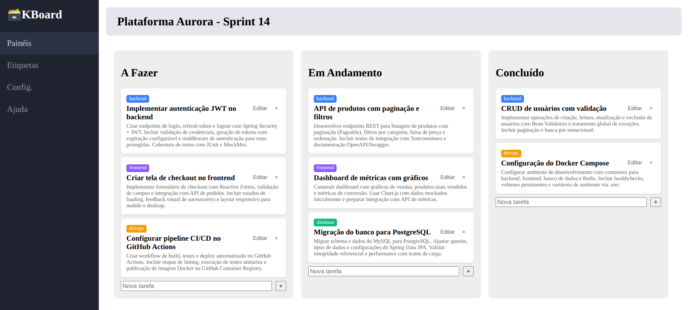
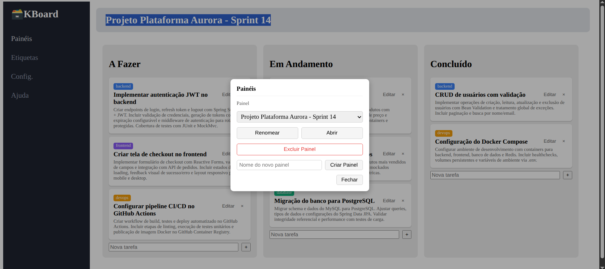
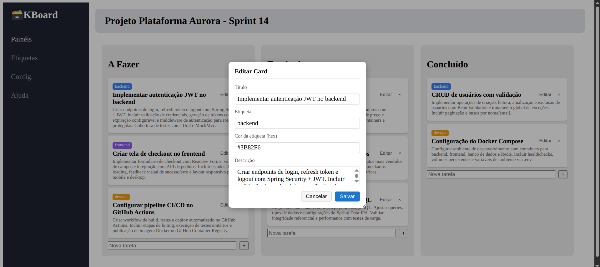

# 🗃️ KBoard

Um quadro Kanban simples, com múltiplos painéis, construído com **Angular** no frontend e **Spring Boot** no backend, persistindo em **MySQL** via Docker.



## Sobre o projeto

KBoard nasceu como um projeto de estudo — um Kanban minimalista, de coluna fixa (`A Fazer` / `Em Andamento` / `Concluído`) — e evoluiu, passo a passo, até suportar múltiplos painéis nomeados, cards com etiqueta e cor livres, arrastar-e-soltar com ordem persistida, e um pequeno conjunto de modais para gerenciar tudo isso.

O projeto foi construído de forma incremental e documentada: cada funcionalidade, correção e decisão de arquitetura está registrada, em ordem cronológica, no [log de desenvolvimento](docs/log-desenvolvimento-kanban.md). Vale a leitura para quem quiser entender não só *o que* foi construído, mas *por quê* — inclusive os erros encontrados e corrigidos no caminho.

## Funcionalidades

- **Múltiplos painéis (boards)**: crie, renomeie e exclua painéis nomeados, cada um com seu próprio conjunto de cards.
- **Três colunas fixas** por painel: `A Fazer`, `Em Andamento`, `Concluído`.
- **Cards completos**: título, descrição livre e uma etiqueta com nome e cor (código hexadecimal) definidos livremente pelo usuário.
- **Arrastar-e-soltar**: mova cards entre colunas ou reordene dentro da mesma coluna — a posição é persistida e sobrevive a um recarregamento da página.
- **Edição em modal**: um modal arrastável e redimensionável permite editar todos os dados de um card sem excluí-lo e recriá-lo.
- **Gerenciamento de painéis em modal**: uma caixa de seleção lista todos os painéis existentes, com ações para renomear, abrir ou excluir (com confirmação) o painel escolhido, e um campo para criar um novo painel.

## Capturas de tela

| Gerenciando painéis | Editando um card |
|---|---|
|  |  |

## Stack

**Backend**
- Java 21
- Spring Boot 4.1
- Spring Data JPA / Hibernate
- MySQL 8

**Frontend**
- Angular (componentes standalone)
- Angular CDK (`drag-drop`) para o arrastar-e-soltar entre colunas

**Infraestrutura**
- Docker / Docker Compose (MySQL)

## Arquitetura

```
projeto/
├── backend/     # API REST em Spring Boot
│   └── src/main/java/com/github/ahaerdy/backend/
│       ├── model/       # Entidades JPA (Card, Board, ColunaEnum, Etiqueta)
│       ├── repository/  # Interfaces Spring Data JPA
│       ├── service/     # Regras de negócio (KanbanService, BoardService)
│       └── web/         # Controllers REST e records de requisição/resposta
├── frontend/    # Aplicação Angular
│   └── src/app/
│       ├── card-item/           # Card individual no quadro
│       ├── card-edit-modal/     # Modal de edição de card
│       ├── card-count/          # Contador de cards (desativado por padrão, ver abaixo)
│       ├── board-selector-modal/ # Modal de gerenciamento de painéis
│       ├── kanban-api.service.ts / kanban-state.service.ts
│       └── board-api.service.ts / board-state.service.ts
└── docs/
    ├── log-desenvolvimento-kanban.md
    └── images/
```

O frontend segue uma arquitetura de estado simples: um serviço `*StateService` por domínio (`KanbanStateService` para cards, `BoardStateService` para painéis), cada um expondo um `Observable` que os componentes consomem — sem gerenciador de estado externo.

## API

A API expõe dois recursos principais:

| Método | Rota | Descrição |
|---|---|---|
| `GET` | `/boards` | Lista todos os painéis |
| `POST` | `/boards` | Cria um painel (`{ "nome": "..." }`) |
| `PUT` | `/boards/{id}` | Renomeia um painel |
| `DELETE` | `/boards/{id}` | Exclui um painel e todos os seus cards |
| `GET` | `/cards?boardId={id}` | Lista os cards de um painel, ordenados |
| `POST` | `/cards` | Cria um card (`{ "titulo", "coluna", "boardId" }`) |
| `PUT` | `/cards/{id}` | Edita título, descrição e etiqueta de um card |
| `PUT` | `/cards/{id}/coluna` | Move um card para outra coluna |
| `PUT` | `/cards/reordenar` | Atualiza a ordem dos cards de uma coluna |
| `DELETE` | `/cards/{id}` | Exclui um card |

## Como rodar localmente

### Pré-requisitos

- Java 21+
- Node.js e Angular CLI
- Docker e Docker Compose

### 1. Banco de dados

Na pasta `backend/`:

```bash
docker compose up -d
```

Isso sobe um container MySQL com o banco `kanban`, na porta `3306`.

> Na primeira inicialização do backend, um painel padrão ("Meu Quadro") é criado automaticamente, e qualquer card pré-existente sem painel é migrado para ele — não é necessário nenhum passo manual.

### 2. Backend

```bash
cd backend
./mvnw spring-boot:run
```

A API sobe em `http://localhost:8080`.

### 3. Frontend

```bash
cd frontend
npm install
ng serve
```

A aplicação fica disponível em `http://localhost:4200`.

## Dados de exemplo

Um dump do banco de dados, com um painel de exemplo já populado, está disponível em [`docs/backup_kanban.sql`](docs/backup_kanban.sql). Para restaurá-lo:

```bash
mysql -h 127.0.0.1 -P 3306 -u SEU_USUARIO -p kanban < docs/backup_kanban.sql
```

## Documentação de desenvolvimento

Este projeto foi construído de forma incremental, com cada etapa documentada em detalhe — objetivo, implementação, decisões de arquitetura e, quando aplicável, o processo de diagnóstico de bugs encontrados ao longo do caminho. O registro completo está em [`docs/log-desenvolvimento-kanban.md`](docs/log-desenvolvimento-kanban.md).

## Melhorias futuras

O projeto foi encerrado, por decisão consciente, com o escopo descrito acima — suficiente para demonstrar o conceito de um quadro Kanban funcional com múltiplos painéis. Ficaram deliberadamente de fora, e são candidatos naturais para uma próxima etapa:

- **Autenticação e autorização.** Hoje qualquer pessoa com acesso à aplicação vê e edita todos os painéis; não há usuários, login nem permissões.
- **Itens da barra lateral sem funcionalidade.** "Etiquetas", "Config." e "Ajuda" existem visualmente, mas não fazem nada — apenas "Painéis" é funcional.
- **Contador de cards desativado.** O componente `CardCountComponent` existe e funciona, mas está comentado no template (`app.html`); reativá-lo é trivial.
- **Posição exata ao mover entre colunas.** Um card movido para outra coluna sempre vai para o fim dela; a posição exata onde foi solto não é preservada (diferente da reordenação dentro da mesma coluna, essa sim precisa).
- **Exclusão do último painel restante.** Nada impede excluir todos os painéis; a aplicação fica funcional, mas sem nenhum painel para exibir, até que um novo seja criado.
- **Validação de entrada no backend.** Os endpoints aceitam o que o frontend envia, sem validação formal (Bean Validation) contra campos vazios, nomes duplicados de painel, ou hexadecimais de cor malformados.
- **Testes automatizados.** O projeto não tem cobertura de testes unitários ou de integração.
- **Tempo real entre sessões.** Duas abas ou usuários diferentes olhando o mesmo painel não se sincronizam automaticamente; é preciso recarregar a página.
- **Anexos, comentários e subtarefas em cards**, e qualquer forma de busca ou filtro de cards.
- **Deploy em produção.** O projeto foi desenvolvido e documentado para rodar localmente; não há configuração de HTTPS, variáveis de ambiente por ambiente, ou pipeline de deploy.

## Licença

Este projeto está licenciado sob a licença MIT — veja o arquivo [`LICENSE`](LICENSE) para o texto completo.

## Autor

- GitHub: [github.com/ahaerdy](https://github.com/ahaerdy)
- LinkedIn: [linkedin.com/in/arthur-haerdy-jr](https://linkedin.com/in/arthur-haerdy-jr)
- E-mail: [arthur.haerdy@gmail.com](mailto:arthur.haerdy@gmail.com)
