# LOG de Desenvolvimento: Kanban em Java e Angular

## Sobre este Projeto

Aplicação de quadro Kanban, com backend em Java (Spring Boot) e frontend em Angular. O quadro possui três colunas fixas (A Fazer, Em Andamento e Concluído), com suporte a criação, movimentação (arrastar e soltar) e remoção de tarefas. A persistência de dados é realizada em banco MySQL, executado em container Docker.

Este documento é o registro cronológico das decisões tomadas ao longo da construção do projeto: o que foi implementado, os motivos de cada escolha e as limitações concretas que motivaram cada mudança de estrutura no código. A leitura sequencial deste LOG permite acompanhar o raciocínio de engenharia por trás do projeto, e não apenas o resultado final.

O desenvolvimento segue a metodologia de Design Emergente, na qual a estrutura do código evolui a partir de necessidades identificadas durante a implementação, em vez de um planejamento arquitetural definido antecipadamente. Este é o segundo projeto conduzido sob essa metodologia, após um primeiro exercício com um jogo de Sudoku em Java.

## Stack Utilizada

- **Frontend:** Angular 22 (componentes standalone), TypeScript, SCSS
- **Backend:** Java 21, Spring Boot 4.1.1
- **Banco de dados:** MySQL, executado via Docker Compose (a ser incorporado a partir da Parte 12)
- **Ferramentas de arrastar e soltar:** Angular CDK
- **Editores:** Visual Studio Code (frontend), IntelliJ IDEA (backend)
- *(demais dependências e ferramentas serão listadas conforme forem incorporadas ao projeto)*

## Estrutura deste LOG

Cada entrada corresponde a um momento de evolução real do código, geralmente motivado por uma repetição identificada durante a implementação, por uma limitação estrutural percebida no template, ou por uma necessidade funcional nova. As entradas são cumulativas: decisões registradas em uma entrada permanecem válidas, ou são explicitamente revistas, nas entradas seguintes.

Este documento será atualizado conforme o desenvolvimento avança. No momento, cobre da configuração inicial do projeto frontend até a persistência real dos dados em um banco de dados MySQL, executado em container Docker, com os dados sobrevivendo a reinícios do backend e do próprio banco, e a restrição do campo `coluna` a um conjunto fechado de valores válidos no backend, por meio de um `enum`, além da evolução do campo `etiqueta` (singular, texto livre) para `etiquetas` (coleção de um `enum` com cor associada). No frontend, um serviço central (`KanbanStateService`) passou a notificar automaticamente qualquer consumidor interessado no estado dos cards, papel ao qual o próprio `App` também migrou, depois de o padrão de notificação ser validado por um segundo consumidor (`CardCountComponent`).

---

## Índice

- [Entrada 0: Configuração Inicial do Projeto](#entrada-0-configuração-inicial-do-projeto)
- [Parte 0: Exibição Inicial da Página](#parte-0-exibição-inicial-da-página)
- [Parte 1: Estrutura das Três Colunas](#parte-1-estrutura-das-três-colunas)
- [Parte 2: Inserção Manual dos Primeiros Cards](#parte-2-inserção-manual-dos-primeiros-cards)
- [Parte 3: Array de Cards e Uso do Bloco `@for`](#parte-3-array-de-cards-e-uso-do-bloco-for)
- [Parte 4: Extração da Interface `Card` e Centralização do Filtro por Coluna](#parte-4-extração-da-interface-card-e-centralização-do-filtro-por-coluna)
- [Parte 5: Extração do Componente de Card](#parte-5-extração-do-componente-de-card)
- [Parte 6: Arrastar e Soltar entre Colunas (Angular CDK)](#parte-6-arrastar-e-soltar-entre-colunas-angular-cdk)
- [Parte 7: Criação e Remoção de Cards, e Introdução do Identificador Único](#parte-7-criação-e-remoção-de-cards-e-introdução-do-identificador-único)
- [Parte 8: Configuração Inicial do Backend e Primeiro Endpoint](#parte-8-configuração-inicial-do-backend-e-primeiro-endpoint)
- [Parte 9: Integração entre Frontend e Backend](#parte-9-integração-entre-frontend-e-backend)
- [Parte 10: Extração do Domínio no Backend](#parte-10-extração-do-domínio-no-backend)
- [Parte 11: CRUD Completo pela API](#parte-11-crud-completo-pela-api)
- [Parte 12: Persistência em MySQL via Docker Compose](#parte-12-persistência-em-mysql-via-docker-compose)
- [Parte 13: Campo `coluna` como `enum` no Backend](#parte-13-campo-coluna-como-enum-no-backend)
- [Parte 14: Etiquetas como Coleção de `Enum` com Cor](#parte-14-etiquetas-como-coleção-de-enum-com-cor)
- [Parte 15: `KanbanStateService` e um Segundo Consumidor do Estado](#parte-15-kanbanstateservice-e-um-segundo-consumidor-do-estado)
- [Parte 16: Migração de `App` para o `KanbanStateService`](#parte-16-migração-de-app-para-o-kanbanstateservice)

---

## Entrada 0: Configuração Inicial do Projeto

**Data:** [preencher]

**Objetivo:** iniciar um quadro Kanban funcional, validando primeiro a interface visual e, em seguida, incorporando progressivamente a estrutura de dados, a integração com o backend e a persistência.

Decisões tomadas antes do início da implementação:

- O desenvolvimento parte do frontend. A prioridade é obter algo visível na tela o quanto antes, mesmo sem nenhuma estrutura de dados implementada. A lógica de domínio será incorporada conforme se tornar necessária.
- Estrutura do repositório definida como segue: pasta raiz `kanban-java-angular`, contendo a subpasta `projeto`, dentro da qual residem, separadamente, `frontend` e `backend`.
- Frontend gerado via Angular CLI (versão 22), sem roteamento (`--routing=false`) e com SCSS como pré-processador de estilos (`--style=scss`).
- Backend a ser incorporado em etapa posterior, com Java 21 e Spring Boot.
- Sem dependências externas no frontend neste momento, além do que o Angular CLI inclui por padrão.

Repositório criado. Registro da próxima entrada previsto para a primeira execução funcional em tela.

<p align="center">
  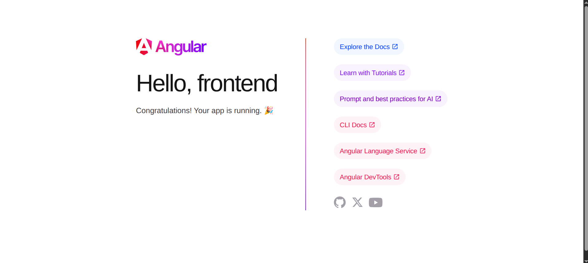
</p>

---

## Parte 0: Exibição Inicial da Página

### Objetivo

Validar o ambiente de desenvolvimento por meio da exibição de uma página no navegador, sem qualquer elemento de domínio (coluna, card, etiqueta) envolvido. Trata-se da forma mais direta de confirmar que o ambiente Angular está corretamente configurado.

### Implementação Realizada

- Geração do projeto por meio do comando `ng new frontend --routing=false --style=scss`, executado dentro da pasta `projeto`.
- Remoção do conteúdo de exemplo gerado pelo CLI em `app.html`.
- Simplificação de `app.ts`, removendo a propriedade de exemplo gerada automaticamente.

### Código

`src/app/app.ts`:

```typescript
import { Component } from '@angular/core';

@Component({
  imports: [],
  selector: 'app-root',
  styleUrl: './app.scss',
  templateUrl: './app.html',
})
export class App {}
```

`src/app/app.html`:

```html
<h1>Kanban</h1>
```

### Descrição Técnica

- A versão utilizada do Angular CLI (22) gera, por padrão, componentes standalone, sem a necessidade de um módulo central (`NgModule`) agregando as dependências da aplicação. Cada componente declara suas próprias dependências por meio do array `imports`.
- A classe do componente raiz é nomeada `App`, e não `AppComponent`, seguindo a convenção de nomenclatura atual do CLI, que não utiliza mais o sufixo `.component` nos nomes de arquivo ou de classe.
- As propriedades `templateUrl` e `styleUrl` apontam, respectivamente, para o arquivo de template (`app.html`) e de estilo (`app.scss`) do componente, gerados em arquivos separados pelo CLI.
- Nenhuma estrutura de dados foi introduzida nesta etapa. A decisão é deliberada: não havia, neste ponto, informação suficiente sobre o problema para justificar a criação de modelos ou serviços.

### Glossário

| Termo | Significado |
|---|---|
| **Angular CLI** | Ferramenta de linha de comando utilizada para gerar, executar e compilar projetos Angular. |
| **Componente standalone** | Componente Angular que declara suas próprias dependências, sem depender de um módulo central. |
| **`ng serve`** | Comando que compila o projeto e o disponibiliza localmente, com recompilação automática a cada alteração. |

### Resultado

Execução de `ng serve` concluída com sucesso. Exibição do texto "Kanban" em `http://localhost:4200`, sem nenhum outro elemento visual, conforme previsto.

<p align="center">
  
</p>

---

## Parte 1: Estrutura das Três Colunas

### Objetivo

Construir o esqueleto visual do quadro Kanban, com as três colunas fixas (A Fazer, Em Andamento e Concluído) dispostas lado a lado, ainda sem qualquer estrutura de dados associada.

### Implementação Realizada

- Edição de `app.html`, com a marcação das três colunas.
- Edição de `app.scss`, com as regras de layout correspondentes (disposição horizontal via `flexbox`).

### Código

`src/app/app.html`:

```html
<h1>Kanban</h1>
<div class="board">
  <div class="column">
    <h2>A Fazer</h2>
  </div>
  <div class="column">
    <h2>Em Andamento</h2>
  </div>
  <div class="column">
    <h2>Concluído</h2>
  </div>
</div>
```

`src/app/app.scss`:

```scss
.board { display: flex; gap: 1rem; padding: 1rem; }
.column { background: #eee; border-radius: 8px; padding: 1rem; width: 260px; }
```

### Descrição Técnica

- A propriedade `display: flex`, aplicada ao seletor `.board`, organiza os elementos filhos `.column` em disposição horizontal, sem necessidade de cálculo manual de posicionamento.
- Cada coluna, nesta etapa, contém apenas o seu título, repetido de forma explícita no template para cada uma das três colunas. Essa repetição é considerada aceitável neste momento, uma vez que nenhuma outra informação além do título está presente.

### Glossário

| Termo | Significado |
|---|---|
| **`display: flex`** | Modo de layout CSS que organiza os elementos filhos em disposição horizontal (ou vertical) flexível, sem posicionamento manual. |

### Resultado

Exibição correta das três colunas, dispostas lado a lado, com fundo em tom de cinza claro e título individual em cada uma, conforme previsto.

<p align="center">
  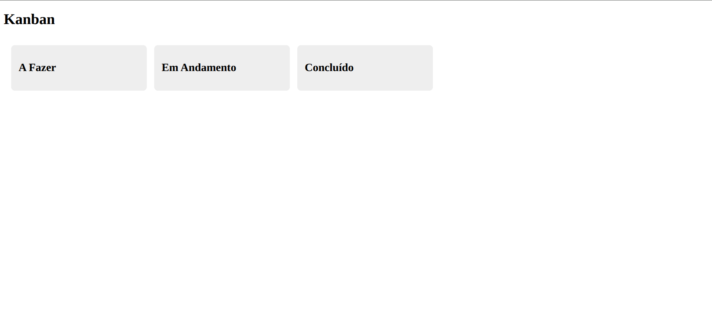
</p>

---

## Parte 2: Inserção Manual dos Primeiros Cards

### Objetivo

Inserir os primeiros cards de exemplo dentro das colunas correspondentes, com título e etiqueta colorida, reproduzindo visualmente o padrão observado no protótipo de referência utilizado como base para o projeto.

### Implementação Realizada

- Inclusão, diretamente no template `app.html`, dos blocos correspondentes a cada card, distribuídos manualmente entre as três colunas.
- Inclusão, em `app.scss`, das regras de estilo para os cards e para cada uma das etiquetas utilizadas.

### Código

`src/app/app.html`:

```html
<h1>Kanban</h1>
<div class="board">
  <div class="column">
    <h2>A Fazer</h2>
    <div class="card">
      <span class="tag tag-profissional">Profissional</span>
      <strong>Concluir E-commerce Portfolio</strong>
    </div>
    <div class="card">
      <span class="tag tag-estudos">Estudos</span>
      <strong>O'Reilly Java Learning Path</strong>
    </div>
  </div>
  <div class="column">
    <h2>Em Andamento</h2>
    <div class="card">
      <span class="tag tag-github">Github</span>
      <strong>Finalizar Debugging Design Patterns</strong>
    </div>
  </div>
  <div class="column">
    <h2>Concluído</h2>
    <div class="card">
      <span class="tag tag-profissional">Profissional</span>
      <strong>Melhorar Apresentação Perfil Github</strong>
    </div>
  </div>
</div>
```

`src/app/app.scss`:

```scss
.board { display: flex; gap: 1rem; padding: 1rem; }
.column { background: #eee; border-radius: 8px; padding: 1rem; width: 260px; }
.card { background: white; border-radius: 6px; padding: 0.75rem; margin-bottom: 0.5rem; box-shadow: 0 1px 2px rgba(0,0,0,.15); }
.tag { display: inline-block; font-size: 0.7rem; color: white; border-radius: 4px; padding: 2px 6px; margin-bottom: 4px; }
.tag-profissional { background: #7e57c2; }
.tag-estudos { background: #43a047; }
.tag-github { background: #29b6f6; }
```

### Descrição Técnica

- Cada card foi inserido individualmente no template, sem nenhuma estrutura de dados subjacente. A criação de um card adicional exigiria a duplicação manual de todo o bloco HTML correspondente.
- Cada nova etiqueta exige a criação manual de uma classe CSS específica (`tag-*`), sem centralização das cores utilizadas.

### Limitações Identificadas

A implementação desta etapa evidenciou os seguintes pontos, a serem tratados em etapas subsequentes:

1. Inexistência de qualquer representação de "card" como entidade no código. Toda a informação existe apenas como marcação HTML, sem possibilidade de manipulação programática (contagem, movimentação ou remoção de itens).
2. Duplicação de código a cada novo card, com risco de inconsistência entre os blocos.
3. Necessidade de criação de uma nova classe CSS a cada nova etiqueta, sem centralização de cores.

Essas limitações são registradas nesta etapa, mas não tratadas de imediato. O tratamento é previsto para a etapa seguinte, com a introdução de uma estrutura de dados para representar os cards.

### Glossário

| Termo | Significado |
|---|---|
| **`box-shadow`** | Propriedade CSS que aplica sombra ao redor de um elemento, utilizada para dar profundidade visual ao card. |

### Resultado

Exibição correta dos quatro cards de exemplo, cada um posicionado na coluna correspondente, com etiqueta colorida exibida acima do título, conforme previsto.

<p align="center">
  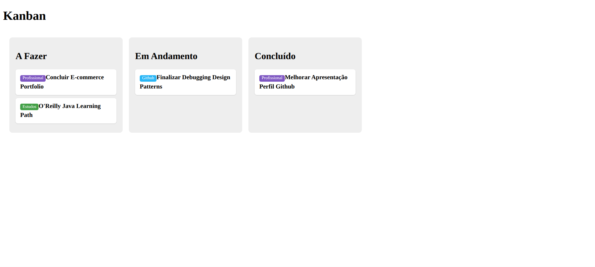
</p>

---

## Parte 3: Array de Cards e Uso do Bloco `@for`

### Objetivo

Eliminar a duplicação manual de marcação HTML observada na Parte 2, introduzindo uma estrutura de dados única para representar os cards e delegando ao Angular a repetição da marcação correspondente a cada item.

### Implementação Realizada

- Migração dos dados dos cards, até então presentes apenas como marcação HTML em `app.html`, para um array de objetos declarado em `app.ts`.
- Substituição da marcação repetida por três blocos de controle de fluxo `@for`, um para cada coluna, cada um percorrendo o array completo e filtrando o conteúdo por meio de um bloco `@if` interno.

### Código

`src/app/app.ts`:

```typescript
import { Component } from '@angular/core';

@Component({
  imports: [],
  selector: 'app-root',
  styleUrl: './app.scss',
  templateUrl: './app.html',
})
export class App {
  cards = [
    { titulo: 'Concluir E-commerce Portfolio', etiqueta: 'Profissional', coluna: 'A_FAZER' },
    { titulo: "O'Reilly Java Learning Path", etiqueta: 'Estudos', coluna: 'A_FAZER' },
    { titulo: 'Finalizar Debugging Design Patterns', etiqueta: 'Github', coluna: 'EM_ANDAMENTO' },
    { titulo: 'Melhorar Apresentação Perfil Github', etiqueta: 'Profissional', coluna: 'CONCLUIDO' },
  ];
}
```

`src/app/app.html`:

```html
<h1>Kanban</h1>
<div class="board">
  <div class="column">
    <h2>A Fazer</h2>
    @for (c of cards; track c) {
      @if (c.coluna === 'A_FAZER') {
        <div class="card">
          <span class="tag">{{ c.etiqueta }}</span>
          <strong>{{ c.titulo }}</strong>
        </div>
      }
    }
  </div>
  <div class="column">
    <h2>Em Andamento</h2>
    @for (c of cards; track c) {
      @if (c.coluna === 'EM_ANDAMENTO') {
        <div class="card">
          <span class="tag">{{ c.etiqueta }}</span>
          <strong>{{ c.titulo }}</strong>
        </div>
      }
    }
  </div>
  <div class="column">
    <h2>Concluído</h2>
    @for (c of cards; track c) {
      @if (c.coluna === 'CONCLUIDO') {
        <div class="card">
          <span class="tag">{{ c.etiqueta }}</span>
          <strong>{{ c.titulo }}</strong>
        </div>
      }
    }
  </div>
</div>
```

### Descrição Técnica

- Os dados de cada card passaram a existir como um objeto literal, com os campos `titulo`, `etiqueta` e `coluna` agrupados. Ainda não foi definido um tipo nomeado para essa estrutura, apenas a inferência automática do TypeScript a partir do array declarado.
- `@for (c of cards; track c)` é o bloco de controle de fluxo do Angular responsável por repetir a marcação para cada item do array. A cláusula `track` é obrigatória e informa ao Angular como identificar cada item entre uma renderização e outra. Como os objetos ainda não possuem um identificador próprio, a identidade utilizada é o próprio objeto.
- O bloco `@if`, aninhado dentro do `@for`, restringe a exibição aos itens cuja coluna corresponde à coluna atual. Essa combinação é repetida três vezes, uma para cada coluna.

### Limitações Identificadas

1. O array `cards` é percorrido três vezes, uma por coluna, com a mesma lógica de filtragem escrita de forma independente em cada bloco. Qualquer alteração nessa lógica exigiria três edições coordenadas.
2. Não existe, ainda, um tipo nomeado que garanta a presença e o formato correto dos campos `titulo`, `etiqueta` e `coluna` em cada item do array.
3. O nome de cada coluna aparece em dois lugares distintos: no título fixo (`<h2>`) e na constante de comparação (por exemplo, `'A_FAZER'`). Uma divergência entre os dois não seria detectada pelo compilador.

O tratamento dessas limitações é previsto para a etapa seguinte, com a introdução de um tipo nomeado para o card e a centralização da lógica de filtragem em um único método.

### Glossário

| Termo | Significado |
|---|---|
| **`@for` / `track`** | Bloco de controle de fluxo do Angular utilizado para repetir marcação para cada item de uma coleção. A cláusula `track` define o critério de identidade de cada item entre renderizações. |
| **Objeto literal** | Valor no formato `{ campo: valor, ... }`, criado sem um tipo nomeado (classe ou interface) associado. |

### Resultado

Exibição idêntica à obtida na Parte 2, com os quatro cards de exemplo posicionados corretamente em suas respectivas colunas, agora originados de uma estrutura de dados em vez de marcação HTML fixa.

<p align="center">
  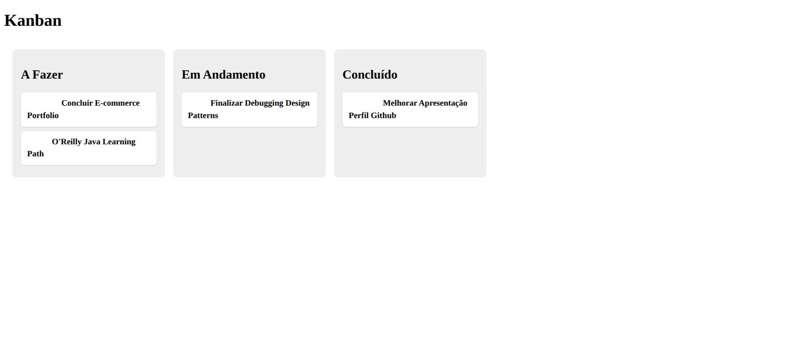
</p>

---

## Parte 4: Extração da Interface `Card` e Centralização do Filtro por Coluna

### Objetivo

Corrigir as duas limitações registradas na etapa anterior: a ausência de um tipo nomeado para o card e a duplicação da lógica de filtragem por coluna.

### Implementação Realizada

- Criação do arquivo `src/app/models/card.ts`, contendo a interface `Card`.
- Substituição do tipo inferido automaticamente pelo tipo explícito `Card[]` na declaração do array em `app.ts`.
- Criação do método `porColuna`, responsável por filtrar o array de cards por coluna, eliminando a necessidade do bloco `@if` aninhado no template.

### Código

`src/app/models/card.ts`:

```typescript
export interface Card {
  titulo: string;
  etiqueta: string;
  coluna: 'A_FAZER' | 'EM_ANDAMENTO' | 'CONCLUIDO';
}
```

`src/app/app.ts`:

```typescript
import { Component } from '@angular/core';
import { Card } from './models/card';

@Component({
  imports: [],
  selector: 'app-root',
  styleUrl: './app.scss',
  templateUrl: './app.html',
})
export class App {
  cards: Card[] = [
    { titulo: 'Concluir E-commerce Portfolio', etiqueta: 'Profissional', coluna: 'A_FAZER' },
    { titulo: "O'Reilly Java Learning Path", etiqueta: 'Estudos', coluna: 'A_FAZER' },
    { titulo: 'Finalizar Debugging Design Patterns', etiqueta: 'Github', coluna: 'EM_ANDAMENTO' },
    { titulo: 'Melhorar Apresentação Perfil Github', etiqueta: 'Profissional', coluna: 'CONCLUIDO' },
  ];

  porColuna(coluna: Card['coluna']): Card[] {
    return this.cards.filter(c => c.coluna === coluna);
  }
}
```

`src/app/app.html`:

```html
<h1>Kanban</h1>
<div class="board">
  <div class="column">
    <h2>A Fazer</h2>
    @for (c of porColuna('A_FAZER'); track c) {
      <div class="card">
        <span class="tag">{{ c.etiqueta }}</span>
        <strong>{{ c.titulo }}</strong>
      </div>
    }
  </div>
  <div class="column">
    <h2>Em Andamento</h2>
    @for (c of porColuna('EM_ANDAMENTO'); track c) {
      <div class="card">
        <span class="tag">{{ c.etiqueta }}</span>
        <strong>{{ c.titulo }}</strong>
      </div>
    }
  </div>
  <div class="column">
    <h2>Concluído</h2>
    @for (c of porColuna('CONCLUIDO'); track c) {
      <div class="card">
        <span class="tag">{{ c.etiqueta }}</span>
        <strong>{{ c.titulo }}</strong>
      </div>
    }
  </div>
</div>
```

### Descrição Técnica

- A interface `Card` define o formato esperado de cada item do array, com o campo `coluna` restrito a um conjunto fechado de três valores possíveis (`'A_FAZER' | 'EM_ANDAMENTO' | 'CONCLUIDO'`), por meio de um tipo de união de literais de string. Qualquer valor fora desse conjunto é rejeitado pelo compilador.
- O método `porColuna` centraliza, em um único ponto, a lógica de filtragem por coluna. As três chamadas no template (`porColuna('A_FAZER')`, `porColuna('EM_ANDAMENTO')`, `porColuna('CONCLUIDO')`) reutilizam a mesma implementação, alterando apenas o parâmetro informado.
- O bloco `@if`, presente na etapa anterior dentro de cada `@for`, deixou de ser necessário: cada `@for` já recebe, do método `porColuna`, apenas os itens pertencentes à coluna correspondente.

### Glossário

| Termo | Significado |
|---|---|
| **`interface`** (TypeScript) | Contrato que descreve o formato de um objeto (quais campos existem e de que tipo), sem gerar código em tempo de execução. |
| **Tipo de união de literais de string** | Tipo formado pela união de valores de string específicos, restringindo uma variável a um conjunto fechado de valores possíveis. |
| **`Array.prototype.filter`** | Método nativo do JavaScript que retorna um novo array contendo apenas os elementos que satisfazem uma condição informada. |

### Resultado

Comportamento visual idêntico ao obtido na etapa anterior. A verificação de tipos, em tempo de compilação, passou a impedir a atribuição de um valor de coluna fora do conjunto definido pela interface `Card`.

<p align="center">
  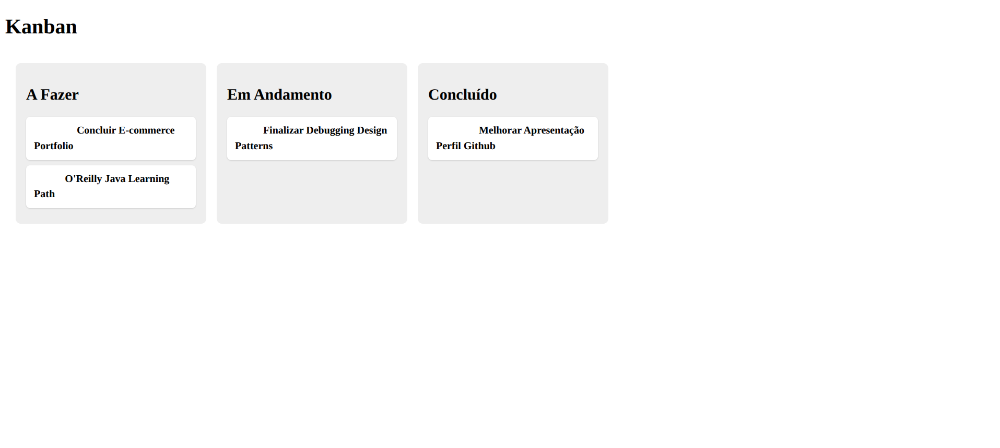
</p>

---

## Parte 5: Extração do Componente de Card

### Objetivo

Separar, em um componente próprio, a responsabilidade de representar visualmente um card individual, até então acumulada pelo componente raiz junto com a orquestração geral do quadro.

### Uma observação sobre nomenclatura

A convenção atual do Angular CLI, ao gerar um componente por meio do comando `ng generate component`, nomeia a classe resultante sem sufixo, com base apenas no nome informado. Um componente gerado com o nome `card` resultaria em uma classe `Card`, em conflito direto com a interface de domínio `Card`, definida na Parte 4. Por esse motivo, o componente foi criado manualmente, com o nome `CardItemComponent`, evitando a colisão de nomes entre a interface de domínio e o componente visual.

### Implementação Realizada

- Criação da pasta `src/app/card-item`, contendo os arquivos `card-item.ts`, `card-item.html` e `card-item.scss`.
- Migração da marcação e do estilo relativos a um card individual, anteriormente presentes em `app.html` e `app.scss`, para os arquivos do novo componente.
- Declaração de uma propriedade de entrada (`@Input`) em `CardItemComponent`, para o recebimento do card a ser exibido.
- Atualização de `app.ts` e `app.html`, substituindo a marcação inline do card pelo uso do novo componente.

### Código

`src/app/card-item/card-item.ts`:

```typescript
import { Component, Input } from '@angular/core';
import { Card } from '../models/card';

@Component({
  imports: [],
  selector: 'app-card-item',
  styleUrl: './card-item.scss',
  templateUrl: './card-item.html',
})
export class CardItemComponent {
  @Input({ required: true }) card!: Card;
}
```

`src/app/card-item/card-item.html`:

```html
<div class="card">
  <span class="tag">{{ card.etiqueta }}</span>
  <strong>{{ card.titulo }}</strong>
</div>
```

`src/app/card-item/card-item.scss`:

```scss
.card { background: white; border-radius: 6px; padding: 0.75rem; margin-bottom: 0.5rem; box-shadow: 0 1px 2px rgba(0,0,0,.15); }
.tag { display: inline-block; font-size: 0.7rem; color: white; background: #7e57c2; border-radius: 4px; padding: 2px 6px; margin-bottom: 4px; }
```

`src/app/app.ts`:

```typescript
import { Component } from '@angular/core';
import { Card } from './models/card';
import { CardItemComponent } from './card-item/card-item';

@Component({
  imports: [CardItemComponent],
  selector: 'app-root',
  styleUrl: './app.scss',
  templateUrl: './app.html',
})
export class App {
  cards: Card[] = [
    { titulo: 'Concluir E-commerce Portfolio', etiqueta: 'Profissional', coluna: 'A_FAZER' },
    { titulo: "O'Reilly Java Learning Path", etiqueta: 'Estudos', coluna: 'A_FAZER' },
    { titulo: 'Finalizar Debugging Design Patterns', etiqueta: 'Github', coluna: 'EM_ANDAMENTO' },
    { titulo: 'Melhorar Apresentação Perfil Github', etiqueta: 'Profissional', coluna: 'CONCLUIDO' },
  ];

  porColuna(coluna: Card['coluna']): Card[] {
    return this.cards.filter(c => c.coluna === coluna);
  }
}
```

`src/app/app.html`:

```html
<h1>Kanban</h1>
<div class="board">
  <div class="column">
    <h2>A Fazer</h2>
    @for (c of porColuna('A_FAZER'); track c) {
      <app-card-item [card]="c" />
    }
  </div>
  <div class="column">
    <h2>Em Andamento</h2>
    @for (c of porColuna('EM_ANDAMENTO'); track c) {
      <app-card-item [card]="c" />
    }
  </div>
  <div class="column">
    <h2>Concluído</h2>
    @for (c of porColuna('CONCLUIDO'); track c) {
      <app-card-item [card]="c" />
    }
  </div>
</div>
```

`src/app/app.scss`, com as regras `.card` e `.tag` removidas, uma vez que passaram a residir em `card-item.scss`:

```scss
.board { display: flex; gap: 1rem; padding: 1rem; }
.column { background: #eee; border-radius: 8px; padding: 1rem; width: 260px; }
```

### Descrição Técnica

- `@Input({ required: true }) card!: Card` declara que `CardItemComponent` recebe, obrigatoriamente, um objeto do tipo `Card` de seu componente pai. A ausência dessa propriedade em qualquer uso do componente é reportada em tempo de compilação.
- O array `imports`, no decorator `@Component` de `App`, passou a incluir `CardItemComponent`, tornando explícita a dependência entre os dois componentes. Não existe, nesta versão do Angular, um módulo central responsável por essa declaração: cada componente relaciona, individualmente, os demais componentes que utiliza em seu template.
- O componente raiz (`App`) deixou de conter qualquer conhecimento sobre a apresentação visual de um card, retendo apenas a responsabilidade de organizar os cards em colunas. Essa separação reduz a quantidade de responsabilidades atribuídas a uma única classe.
- Trata-se de uma extração de natureza estrutural. Nenhum comportamento novo foi introduzido nesta etapa.

### Glossário

| Termo | Significado |
|---|---|
| **`@Input()`** | Decorator que declara uma propriedade de um componente como recebível de seu componente pai, por meio de vinculação de dados. |
| **`required: true`** (em `@Input`) | Opção que torna obrigatória a passagem do valor correspondente; sua ausência é reportada pelo compilador. |
| **Componente filho / componente pai** | Relação entre um componente utilizado dentro de outro, com recebimento de dados por meio de `@Input`. |

### Resultado

Comportamento visual idêntico ao obtido na etapa anterior. A alteração do estilo de um card, realizada exclusivamente em `card-item.scss`, não exigiu qualquer modificação em `app.ts` ou `app.html`, confirmando o isolamento efetivo da responsabilidade.

<p align="center">
  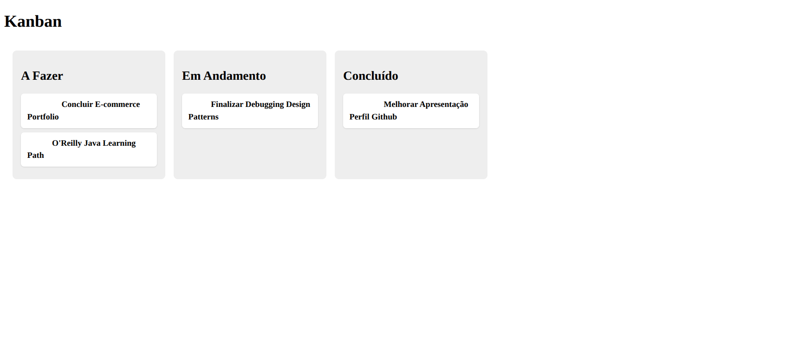
</p>

---

## Parte 6: Arrastar e Soltar entre Colunas (Angular CDK)

### Objetivo

Implementar a movimentação de cards entre colunas por meio de arrastar e soltar, funcionalidade central de um quadro Kanban.

### Implementação Realizada

- Instalação do pacote `@angular/cdk`.
- Reestruturação dos dados, anteriormente concentrados em um único array `cards` filtrado por coluna, para três arrays independentes (`aFazer`, `emAndamento`, `concluido`), um por coluna. Essa mudança foi motivada pela forma como o módulo de arrastar e soltar do Angular CDK opera: cada zona de soltar recebe sua própria lista de dados, e a movimentação de um item entre zonas requer que ele seja de fato transferido de um array para outro.
- Adição da diretiva `cdkDropList` a cada coluna, conectando as três entre si por meio de `cdkDropListConnectedTo`, e da diretiva `cdkDrag` a cada card.
- Implementação do método `drop`, responsável por reordenar um card dentro da mesma coluna ou transferi-lo para outra coluna, conforme o resultado da operação de soltar.

### Código

`src/app/app.ts`:

```typescript
import { Component } from '@angular/core';
import { DragDropModule, CdkDragDrop, moveItemInArray, transferArrayItem } from '@angular/cdk/drag-drop';
import { Card } from './models/card';
import { CardItemComponent } from './card-item/card-item';

@Component({
  imports: [CardItemComponent, DragDropModule],
  selector: 'app-root',
  styleUrl: './app.scss',
  templateUrl: './app.html',
})
export class App {
  aFazer: Card[] = [
    { titulo: 'Concluir E-commerce Portfolio', etiqueta: 'Profissional', coluna: 'A_FAZER' },
    { titulo: "O'Reilly Java Learning Path", etiqueta: 'Estudos', coluna: 'A_FAZER' },
  ];
  emAndamento: Card[] = [
    { titulo: 'Finalizar Debugging Design Patterns', etiqueta: 'Github', coluna: 'EM_ANDAMENTO' },
  ];
  concluido: Card[] = [
    { titulo: 'Melhorar Apresentação Perfil Github', etiqueta: 'Profissional', coluna: 'CONCLUIDO' },
  ];

  drop(event: CdkDragDrop<Card[]>) {
    if (event.previousContainer === event.container) {
      moveItemInArray(event.container.data, event.previousIndex, event.currentIndex);
    } else {
      transferArrayItem(event.previousContainer.data, event.container.data, event.previousIndex, event.currentIndex);
    }
  }
}
```

`src/app/app.html`:

```html
<h1>Kanban</h1>
<div class="board">
  <div class="column">
    <h2>A Fazer</h2>
    <div cdkDropList [cdkDropListData]="aFazer" [cdkDropListConnectedTo]="['emAndamento','concluido']"
         id="aFazer" (cdkDropListDropped)="drop($event)" class="dropzone">
      @for (c of aFazer; track c) {
        <app-card-item [card]="c" cdkDrag />
      }
    </div>
  </div>
  <div class="column">
    <h2>Em Andamento</h2>
    <div cdkDropList [cdkDropListData]="emAndamento" [cdkDropListConnectedTo]="['aFazer','concluido']"
         id="emAndamento" (cdkDropListDropped)="drop($event)" class="dropzone">
      @for (c of emAndamento; track c) {
        <app-card-item [card]="c" cdkDrag />
      }
    </div>
  </div>
  <div class="column">
    <h2>Concluído</h2>
    <div cdkDropList [cdkDropListData]="concluido" [cdkDropListConnectedTo]="['aFazer','emAndamento']"
         id="concluido" (cdkDropListDropped)="drop($event)" class="dropzone">
      @for (c of concluido; track c) {
        <app-card-item [card]="c" cdkDrag />
      }
    </div>
  </div>
</div>
```

`src/app/app.scss`:

```scss
.board { display: flex; gap: 1rem; padding: 1rem; }
.column { background: #eee; border-radius: 8px; padding: 1rem; width: 260px; }
.dropzone { min-height: 80px; }
```

### Descrição Técnica

- `cdkDropList` marca um elemento como zona válida para o recebimento de itens arrastáveis. `cdkDrag`, aplicada a cada `app-card-item`, torna o elemento correspondente arrastável.
- `cdkDropListConnectedTo` estabelece a conexão entre as três zonas de soltar. Sem essa propriedade, cada coluna aceitaria apenas itens soltos dentro dela mesma, impedindo a movimentação entre colunas.
- `moveItemInArray`, função utilitária do CDK, reordena os elementos dentro do mesmo array, tratando o caso de reposicionamento de um card na própria coluna. `transferArrayItem` realiza a transferência de um elemento de um array para outro, tratando o caso de movimentação entre colunas.
- O método `drop` distingue os dois casos por meio da comparação entre `event.previousContainer` e `event.container`: contêineres iguais indicam reordenação; contêineres distintos indicam transferência entre colunas.
- O array `imports`, no decorator `@Component`, passou a incluir `DragDropModule`, responsável por disponibilizar as diretivas `cdkDropList` e `cdkDrag` ao template.

### Limitações Identificadas

O campo `coluna`, presente em cada objeto `Card`, não é atualizado pela operação de arrastar e soltar implementada nesta etapa. A movimentação de um card entre arrays reflete corretamente sua posição visual, mas o valor armazenado no campo `coluna` permanece o original. Essa inconsistência não produz efeito observável no momento, pois nenhuma parte do sistema consulta esse campo após a criação do card. O tratamento é previsto para quando o campo `coluna` passar a ser efetivamente utilizado, momento em que a estrutura de dados poderá ser revista.

### Glossário

| Termo | Significado |
|---|---|
| **Angular CDK** (*Component Dev Kit*) | Biblioteca oficial do Angular com comportamentos de interface reutilizáveis (arrastar e soltar, sobreposição, entre outros), sem estilo visual predefinido. |
| **`cdkDropList`** | Diretiva que marca um elemento como zona válida para o recebimento de itens arrastáveis. |
| **`cdkDrag`** | Diretiva que torna um elemento arrastável dentro de uma `cdkDropList`. |
| **`CdkDragDrop<T>`** | Tipo do evento emitido ao soltar um item, contendo os contêineres de origem e destino, além dos índices de posição. |

### Resultado

Movimentação de cards entre colunas validada com sucesso. Na captura de tela a seguir, o card "Concluir E-commerce Portfolio", originalmente na coluna "A Fazer", foi movido para a coluna "Em Andamento", permanecendo corretamente posicionado após a operação.

<p align="center">
  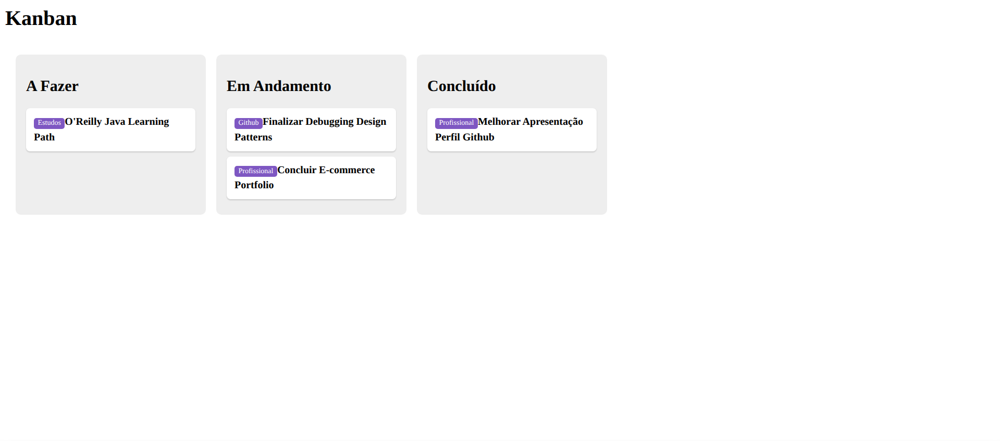
</p>

---

## Parte 7: Criação e Remoção de Cards, e Introdução do Identificador Único

### Objetivo

Permitir a criação de novos cards e a remoção de cards existentes por meio da interface, em cada uma das três colunas.

### Problema Identificado Durante a Implementação

Ao iniciar a implementação do método de remoção, verificou-se a necessidade de identificar de forma inequívoca qual card deveria ser removido. A comparação por título revelou-se insuficiente, uma vez que dois cards distintos podem possuir o mesmo título. Constatou-se, nesse ponto, a ausência de um identificador único por card na estrutura de dados até então utilizada.

### Implementação Realizada

- Inclusão do campo `id` na interface `Card`, gerado por meio da API `crypto.randomUUID()`, nativa do navegador.
- Inclusão de um botão de remoção em cada card, implementado por meio de um evento customizado (`@Output`) emitido pelo componente `CardItemComponent` e tratado pelo componente `App`.
- Inclusão de um campo de texto e um botão de adição em cada coluna, permitindo a criação de novos cards diretamente pela interface.
- Alteração da cláusula `track`, no bloco `@for` de cada coluna, de `track c` para `track c.id`, adotando o identificador único recém-introduzido como critério de rastreamento.

### Código

`src/app/models/card.ts`:

```typescript
export interface Card {
  id: string;
  titulo: string;
  etiqueta: string;
}
```

`src/app/card-item/card-item.ts`:

```typescript
import { Component, EventEmitter, Input, Output } from '@angular/core';
import { Card } from '../models/card';

@Component({
  imports: [],
  selector: 'app-card-item',
  styleUrl: './card-item.scss',
  templateUrl: './card-item.html',
})
export class CardItemComponent {
  @Input({ required: true }) card!: Card;
  @Output() remover = new EventEmitter<Card>();
}
```

`src/app/card-item/card-item.html`:

```html
<div class="card">
  <span class="tag">{{ card.etiqueta }}</span>
  <strong>{{ card.titulo }}</strong>
  <button class="remover" (click)="remover.emit(card)">×</button>
</div>
```

`src/app/card-item/card-item.scss`:

```scss
.card { background: white; border-radius: 6px; padding: 0.75rem; margin-bottom: 0.5rem; box-shadow: 0 1px 2px rgba(0,0,0,.15); position: relative; }
.tag { display: inline-block; font-size: 0.7rem; color: white; background: #7e57c2; border-radius: 4px; padding: 2px 6px; margin-bottom: 4px; }
.remover { position: absolute; top: 0.5rem; right: 0.5rem; border: none; background: transparent; cursor: pointer; font-size: 0.9rem; color: #999; }
```

`src/app/app.ts`:

```typescript
import { Component } from '@angular/core';
import { DragDropModule, CdkDragDrop, moveItemInArray, transferArrayItem } from '@angular/cdk/drag-drop';
import { Card } from './models/card';
import { CardItemComponent } from './card-item/card-item';

@Component({
  imports: [CardItemComponent, DragDropModule],
  selector: 'app-root',
  styleUrl: './app.scss',
  templateUrl: './app.html',
})
export class App {
  aFazer: Card[] = [
    { id: crypto.randomUUID(), titulo: 'Concluir E-commerce Portfolio', etiqueta: 'Profissional' },
    { id: crypto.randomUUID(), titulo: "O'Reilly Java Learning Path", etiqueta: 'Estudos' },
  ];
  emAndamento: Card[] = [
    { id: crypto.randomUUID(), titulo: 'Finalizar Debugging Design Patterns', etiqueta: 'Github' },
  ];
  concluido: Card[] = [
    { id: crypto.randomUUID(), titulo: 'Melhorar Apresentação Perfil Github', etiqueta: 'Profissional' },
  ];

  drop(event: CdkDragDrop<Card[]>) {
    if (event.previousContainer === event.container) {
      moveItemInArray(event.container.data, event.previousIndex, event.currentIndex);
    } else {
      transferArrayItem(event.previousContainer.data, event.container.data, event.previousIndex, event.currentIndex);
    }
  }

  adicionar(coluna: Card[], titulo: string) {
    if (!titulo.trim()) return;
    coluna.push({ id: crypto.randomUUID(), titulo, etiqueta: 'Geral' });
  }

  remover(coluna: Card[], card: Card) {
    const index = coluna.indexOf(card);
    if (index >= 0) coluna.splice(index, 1);
  }
}
```

`src/app/app.html`:

```html
<h1>Kanban</h1>
<div class="board">
  <div class="column">
    <h2>A Fazer</h2>
    <div cdkDropList [cdkDropListData]="aFazer" [cdkDropListConnectedTo]="['emAndamento','concluido']"
         id="aFazer" (cdkDropListDropped)="drop($event)" class="dropzone">
      @for (c of aFazer; track c.id) {
        <app-card-item [card]="c" cdkDrag (remover)="remover(aFazer, $event)" />
      }
    </div>
    <div class="nova-tarefa">
      <input #novoTituloAFazer placeholder="Nova tarefa" />
      <button (click)="adicionar(aFazer, novoTituloAFazer.value); novoTituloAFazer.value = ''">+</button>
    </div>
  </div>
  <div class="column">
    <h2>Em Andamento</h2>
    <div cdkDropList [cdkDropListData]="emAndamento" [cdkDropListConnectedTo]="['aFazer','concluido']"
         id="emAndamento" (cdkDropListDropped)="drop($event)" class="dropzone">
      @for (c of emAndamento; track c.id) {
        <app-card-item [card]="c" cdkDrag (remover)="remover(emAndamento, $event)" />
      }
    </div>
    <div class="nova-tarefa">
      <input #novoTituloEmAndamento placeholder="Nova tarefa" />
      <button (click)="adicionar(emAndamento, novoTituloEmAndamento.value); novoTituloEmAndamento.value = ''">+</button>
    </div>
  </div>
  <div class="column">
    <h2>Concluído</h2>
    <div cdkDropList [cdkDropListData]="concluido" [cdkDropListConnectedTo]="['aFazer','emAndamento']"
         id="concluido" (cdkDropListDropped)="drop($event)" class="dropzone">
      @for (c of concluido; track c.id) {
        <app-card-item [card]="c" cdkDrag (remover)="remover(concluido, $event)" />
      }
    </div>
    <div class="nova-tarefa">
      <input #novoTituloConcluido placeholder="Nova tarefa" />
      <button (click)="adicionar(concluido, novoTituloConcluido.value); novoTituloConcluido.value = ''">+</button>
    </div>
  </div>
</div>
```

`src/app/app.scss`:

```scss
.board { display: flex; gap: 1rem; padding: 1rem; }
.column { background: #eee; border-radius: 8px; padding: 1rem; width: 260px; }
.dropzone { min-height: 80px; }
.nova-tarefa { display: flex; gap: 0.5rem; margin-top: 0.5rem; }
.nova-tarefa input { flex: 1; min-width: 0; }
```

### Descrição Técnica

- `crypto.randomUUID()` gera um identificador único (UUID versão 4), nativo do navegador, sem exigir nenhuma biblioteca externa. Cada card passa a possuir uma identidade própria, independente do seu conteúdo.
- A cláusula `track c.id`, em substituição a `track c`, permite ao Angular reconhecer um mesmo card entre renderizações mesmo que o array seja reordenado ou parcialmente substituído, com base em um valor estável, em vez da referência ao objeto.
- `@Output() remover = new EventEmitter<Card>()`, declarado em `CardItemComponent`, permite que esse componente emita um evento customizado para o componente pai. A chamada `remover.emit(card)`, executada ao clicar no botão de remoção, envia o próprio card removido como dado do evento.
- No template de `App`, a vinculação `(remover)="remover(aFazer, $event)"` associa o evento customizado ao método `remover` do componente pai. `$event` corresponde ao valor emitido, neste caso, o `Card` removido.
- Cada coluna recebeu uma variável de referência de template com nome distinto (`#novoTituloAFazer`, `#novoTituloEmAndamento`, `#novoTituloConcluido`). Variáveis de referência de template possuem escopo em todo o arquivo, não apenas no elemento em que são declaradas; a reutilização do mesmo nome nas três colunas resultaria em erro de compilação por ambiguidade de referência.

### Glossário

| Termo | Significado |
|---|---|
| **UUID** (*Universally Unique Identifier*) | Identificador de 128 bits, praticamente garantido como único, utilizado para distinguir cards com título idêntico. |
| **`@Output()` / `EventEmitter`** | Decorator e classe, complementares ao `@Input()`, que permitem a um componente filho emitir eventos customizados para o componente pai. |
| **Variável de referência de template (`#nome`)** | Identificador declarado em um elemento do template, com escopo em todo o arquivo, utilizado para acessar aquele elemento (ou seu valor) em outro ponto do mesmo template. |

### Resultado

Criação e remoção de cards validadas com sucesso em todas as três colunas. A execução ocorreu conforme previsto, sem necessidade de ajustes adicionais em relação ao planejado.

<p align="center">
  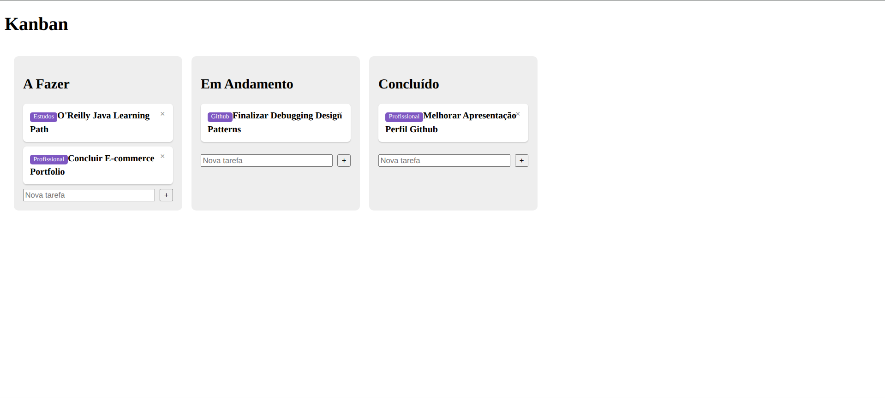
</p>

---

## Parte 8: Configuração Inicial do Backend e Primeiro Endpoint

### Objetivo

Iniciar o projeto de backend em Java e disponibilizar o primeiro endpoint HTTP, com dados fixos, validando a comunicação básica antes de qualquer modelagem de domínio. Esta etapa marca a incorporação do backend ao projeto, motivada pela perda de estado a cada atualização da página no navegador, observada ao final da Parte 7.

### Implementação Realizada

- Criação do projeto Spring Boot por meio do Spring Initializr, com as seguintes configurações: build Maven, linguagem Java, versão 21, Group `com.github.ahaerdy`, Artifact `backend`, dependência `Spring Web`.
- Projeto posicionado em `projeto/backend`, na estrutura de repositório já definida na Entrada 0.
- Criação de um endpoint HTTP (`GET /cards`), retornando uma lista fixa de dois cards, sem nenhuma estrutura de dados nomeada. Os dados e o controlador responsável pela rota foram mantidos, nesta etapa, no mesmo arquivo da classe principal da aplicação.

### Código

`src/main/java/com/github/ahaerdy/backend/BackendApplication.java`:

```java
package com.github.ahaerdy.backend;

import org.springframework.boot.SpringApplication;
import org.springframework.boot.autoconfigure.SpringBootApplication;
import org.springframework.web.bind.annotation.GetMapping;
import org.springframework.web.bind.annotation.RestController;

import java.util.List;
import java.util.Map;

@SpringBootApplication
public class BackendApplication {
    public static void main(String[] args) {
        SpringApplication.run(BackendApplication.class, args);
    }
}

@RestController
class CardController {

    @GetMapping("/cards")
    public List<Map<String, String>> listar() {
        return List.of(
            Map.of("id", "1", "titulo", "Concluir E-commerce Portfolio", "etiqueta", "Profissional", "coluna", "A_FAZER"),
            Map.of("id", "2", "titulo", "Finalizar Debugging Design Patterns", "etiqueta", "Github", "coluna", "EM_ANDAMENTO")
        );
    }
}
```

### Descrição Técnica

- Uma **anotação** Java (`@Algo`) é um metadado anexado a uma classe, método, campo ou parâmetro, sem efeito próprio em tempo de compilação. O comportamento associado a ela é produzido por outro código, em tempo de execução, que lê essa anotação por meio de **reflexão** (a capacidade de um programa Java inspecionar suas próprias classes e anotações enquanto roda). No caso do Spring Boot, esse código é o próprio framework, que varre os pacotes do projeto (*component scan*) à procura de classes e métodos anotados, para decidir o que instanciar e como rotear requisições.
- `@SpringBootApplication` reúne, em uma única anotação, três outras (`@Configuration`, `@EnableAutoConfiguration`, `@ComponentScan`), combinando a auto-configuração do Spring Boot, o escaneamento de componentes e a configuração padrão da aplicação.
- `@RestController` é, por sua vez, uma composição de `@Controller` (que registra a classe como componente gerenciado) e `@ResponseBody` (que serializa o retorno de cada método diretamente no corpo da resposta HTTP, como JSON).
- `@GetMapping("/cards")` é um atalho para `@RequestMapping(value = "/cards", method = RequestMethod.GET)`, associando o método `listar()` a requisições HTTP `GET` na rota `/cards`.
- Os dados retornados são fixos, definidos diretamente no corpo do método, por meio de `List.of(...)` e `Map.of(...)`. Essa escolha é deliberada: neste momento, não há informação suficiente sobre o domínio (persistência, campos necessários) para justificar a criação de uma classe `Card` em Java.
- A dependência selecionada como `Spring Web` no Spring Initializr resolveu-se, na versão 4.1.1 do Spring Boot utilizada, sob o artefato Maven `spring-boot-starter-webmvc`, confirmado no classpath de execução exibido no console. Em versões anteriores do framework, o mesmo artefato era nomeado `spring-boot-starter-web`.

### Glossário

| Termo | Significado |
|---|---|
| **Spring Boot** | Framework Java que simplifica a criação de aplicações standalone, incluindo um servidor HTTP embutido. |
| **Anotação** (*annotation*) | Metadado anexado a uma classe, método, campo ou parâmetro Java, interpretado em tempo de execução por outro código por meio de reflexão. |
| **Reflexão** (*reflection*) | Capacidade de um programa Java inspecionar, em tempo de execução, suas próprias classes, métodos e anotações. |
| **`@RestController`** | Anotação Spring, composta por `@Controller` e `@ResponseBody`, que marca uma classe como controlador REST, serializando os retornos dos métodos como JSON por padrão. |
| **`@GetMapping`** | Atalho de `@RequestMapping` que mapeia um método Java para requisições HTTP `GET` em uma rota específica. |
| **Maven** | Ferramenta de build e gerenciamento de dependências para projetos Java. |
| **Tomcat embutido** | Servidor HTTP incluído automaticamente pelo Spring Boot, dispensando a instalação de um servidor de aplicação separado. |

### Resultado

Aplicação iniciada com sucesso, com o servidor Tomcat embutido disponibilizado na porta 8080, conforme registrado no console de execução. Acesso à rota `http://localhost:8080/cards` pelo navegador retornou o JSON esperado, contendo os dois cards fixos definidos no código, com os campos `id`, `titulo`, `etiqueta` e `coluna` corretamente presentes.

<p align="center">
  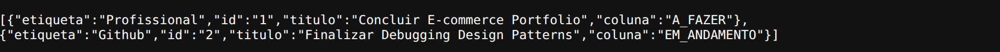
</p>

---

## Parte 9: Integração entre Frontend e Backend

### Objetivo

Substituir os dados fixos do frontend, presentes desde a Parte 7, pela leitura efetiva dos cards a partir do backend, estabelecendo a primeira comunicação HTTP completa entre as duas aplicações.

### Implementação Realizada

- Registro do serviço `HttpClient` do Angular em `app.config.ts`, por meio da função `provideHttpClient`.
- Alteração de `app.ts` para buscar os cards do backend na inicialização do componente, distribuindo-os nos três arrays existentes (`aFazer`, `emAndamento`, `concluido`) conforme o campo `coluna` retornado pela API.
- Adição da anotação `@CrossOrigin`, no backend, autorizando requisições originadas de `http://localhost:4200`.

### Dificuldades Identificadas Durante a Implementação

Duas dificuldades distintas surgiram nesta etapa, ambas sem indicação de erro explícito no console do navegador ou no terminal.

A primeira foi um erro de **CORS** (*Cross-Origin Resource Sharing*), identificado ao inspecionar o console do navegador: o backend, por padrão, recusa requisições originadas de uma porta diferente da sua própria, mecanismo de segurança do próprio navegador. Resolvida com a adição da anotação `@CrossOrigin` ao controlador.

A segunda dificuldade foi mais sutil: mesmo após a resolução do CORS, com a requisição retornando os dados corretos (confirmado por meio de instrumentação temporária com `console.log`), a interface permanecia com as colunas vazias, sem nenhum erro reportado. A investigação identificou a causa como uma característica da versão do Angular utilizada neste projeto (22), na qual a detecção de mudanças deixou de depender da biblioteca Zone.js por padrão. Nessa configuração, denominada *zoneless*, o Angular não reavalia automaticamente a interface após qualquer operação assíncrona, como ocorria em versões anteriores do framework. A reavaliação passa a depender de sinalizações explícitas: leitura de um *signal* alterado, emissão via `AsyncPipe`, execução de um evento vinculado diretamente no template, ou chamada manual de `ChangeDetectorRef.markForCheck()`. Como a atribuição das listas de cards ocorre dentro do retorno assíncrono da requisição HTTP (`subscribe`), fora de qualquer uma dessas situações, a interface nunca era notificada da mudança de estado, apesar de o estado em si estar correto. A resolução consistiu na injeção de `ChangeDetectorRef` no componente e na chamada explícita de `markForCheck()` ao final da atribuição.

### Código

`src/app/app.config.ts`:

```typescript
import { ApplicationConfig, provideBrowserGlobalErrorListeners } from '@angular/core';
import { provideHttpClient } from '@angular/common/http';

export const appConfig: ApplicationConfig = {
  providers: [
    provideBrowserGlobalErrorListeners(),
    provideHttpClient(),
  ]
};
```

`src/app/app.ts`:

```typescript
import { Component, OnInit, inject, ChangeDetectorRef } from '@angular/core';
import { DragDropModule, CdkDragDrop, moveItemInArray, transferArrayItem } from '@angular/cdk/drag-drop';
import { HttpClient } from '@angular/common/http';
import { Card } from './models/card';
import { CardItemComponent } from './card-item/card-item';

interface CardApi extends Card {
  coluna: 'A_FAZER' | 'EM_ANDAMENTO' | 'CONCLUIDO';
}

@Component({
  imports: [CardItemComponent, DragDropModule],
  selector: 'app-root',
  styleUrl: './app.scss',
  templateUrl: './app.html',
})
export class App implements OnInit {
  private http = inject(HttpClient);
  private cdr = inject(ChangeDetectorRef);

  aFazer: Card[] = [];
  emAndamento: Card[] = [];
  concluido: Card[] = [];

  ngOnInit() {
    this.http.get<CardApi[]>('http://localhost:8080/cards').subscribe(cards => {
      this.aFazer = cards.filter(c => c.coluna === 'A_FAZER');
      this.emAndamento = cards.filter(c => c.coluna === 'EM_ANDAMENTO');
      this.concluido = cards.filter(c => c.coluna === 'CONCLUIDO');
      this.cdr.markForCheck();
    });
  }

  drop(event: CdkDragDrop<Card[]>) {
    if (event.previousContainer === event.container) {
      moveItemInArray(event.container.data, event.previousIndex, event.currentIndex);
    } else {
      transferArrayItem(event.previousContainer.data, event.container.data, event.previousIndex, event.currentIndex);
    }
  }

  adicionar(coluna: Card[], titulo: string) {
    if (!titulo.trim()) return;
    coluna.push({ id: crypto.randomUUID(), titulo, etiqueta: 'Geral' });
  }

  remover(coluna: Card[], card: Card) {
    const index = coluna.indexOf(card);
    if (index >= 0) coluna.splice(index, 1);
  }
}
```

`src/main/java/com/github/ahaerdy/backend/BackendApplication.java` (alteração pontual na classe `CardController`, dentro do mesmo arquivo):

```java
@RestController
@CrossOrigin(origins = "http://localhost:4200")
class CardController {

    @GetMapping("/cards")
    public List<Map<String, String>> listar() {
        return List.of(
            Map.of("id", "1", "titulo", "Concluir E-commerce Portfolio", "etiqueta", "Profissional", "coluna", "A_FAZER"),
            Map.of("id", "2", "titulo", "Finalizar Debugging Design Patterns", "etiqueta", "Github", "coluna", "EM_ANDAMENTO")
        );
    }
}
```

### Descrição Técnica

- `provideHttpClient()` registra o serviço `HttpClient` do Angular para toda a aplicação, tornando-o disponível para injeção em qualquer componente ou serviço.
- A interface `CardApi`, que estende `Card` acrescentando o campo `coluna`, foi introduzida para representar o formato exato da resposta da API, sem reintroduzir esse campo no modelo de domínio `Card`, do qual havia sido removido na Parte 7.
- `Zone.js` é a biblioteca historicamente responsável, em versões anteriores do Angular, por interceptar automaticamente operações assíncronas do navegador e disparar a reavaliação da interface. Sua ausência, nesta versão do framework, é o comportamento padrão de projetos gerados pelo `ng new`, não uma configuração adicional realizada neste projeto.
- `ChangeDetectorRef.markForCheck()` notifica manualmente o Angular de que o componente precisa ser reavaliado na próxima verificação de mudanças, suprindo a ausência da notificação automática para atualizações de estado originadas de um retorno assíncrono.
- `@CrossOrigin(origins = "http://localhost:4200")` instrui o Spring a incluir, em toda resposta emitida por esse controlador, o cabeçalho HTTP `Access-Control-Allow-Origin`, verificado pelo navegador antes de permitir que o JavaScript da página leia a resposta. Sem esse cabeçalho, a requisição chega a ser processada pelo backend, mas a resposta é descartada silenciosamente pelo navegador, o que explica o erro aparecer no console do navegador, e não nos logs do backend.

### Glossário

| Termo | Significado |
|---|---|
| **`HttpClient`** | Serviço do Angular para realizar requisições HTTP, baseado em `Observable`. |
| **CORS** (*Cross-Origin Resource Sharing*) | Mecanismo de segurança do navegador que bloqueia, por padrão, requisições entre origens (domínio/porta) diferentes, a menos que o servidor autorize. |
| **Zone.js** | Biblioteca usada por versões mais antigas do Angular para interceptar operações assíncronas do navegador e disparar automaticamente a verificação de mudanças na interface. |
| **Zoneless** | Modo de operação do Angular, padrão na versão utilizada neste projeto, em que a verificação de mudanças depende de notificações explícitas, em vez de interceptação automática de operações assíncronas. |
| **`ChangeDetectorRef.markForCheck()`** | Método que notifica manualmente o Angular de que um componente precisa ser reavaliado na próxima verificação de mudanças. |

### Resultado

Após a correção descrita, os cards passaram a ser exibidos corretamente nas colunas correspondentes, refletindo os dados armazenados no backend. A funcionalidade de criação de cards, já implementada na Parte 7, permaneceu operante durante o teste, confirmando a integração completa entre as duas aplicações.

<p align="center">
  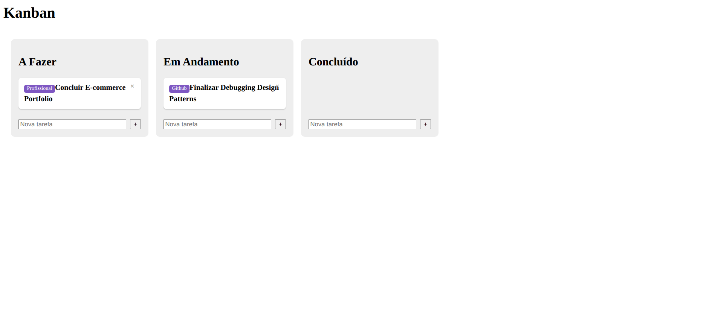
</p>

---

## Parte 10: Extração do Domínio no Backend

### Objetivo

Substituir os dados fixos (`Map.of(...)`) e a lógica de rota, até então concentrados em um único arquivo, por três classes especializadas, cada uma em seu próprio pacote, seguindo o padrão de arquitetura em camadas.

### Implementação Realizada

- Criação da classe `Card`, no pacote `model`, representando o domínio da aplicação (o conceito de "card" de um quadro Kanban) como um tipo nomeado, em substituição ao uso de `Map<String, String>`.
- Criação da classe `KanbanService`, no pacote `service`, concentrando a lógica de negócio, com a lista de cards mantida em uma `CopyOnWriteArrayList`.
- Criação da classe `CardController`, no pacote `web`, reduzida à responsabilidade exclusiva de rotear requisições HTTP para o serviço correspondente.
- Remoção da classe `CardController`, que residia desde a Parte 8 dentro do mesmo arquivo de `BackendApplication`, restando nesse arquivo apenas a classe de inicialização da aplicação.

### Dificuldade Identificada Durante a Implementação

Ao criar o arquivo `KanbanService.java`, o conteúdo colado nele correspondia, por engano, à classe `BackendApplication`, em vez do conteúdo correto da classe `KanbanService`. O compilador Java rejeitou a build com o erro `class BackendApplication is public, should be declared in a file named BackendApplication.java`, evidenciando a divergência entre o nome do arquivo e o nome da classe pública nele declarada. A causa foi identificada por meio da inspeção do conteúdo real do arquivo, e corrigida substituindo-o pelo conteúdo correto da classe `KanbanService`, no pacote apropriado.

### Código

`src/main/java/com/github/ahaerdy/backend/model/Card.java`:

```java
package com.github.ahaerdy.backend.model;

public class Card {

    private String id;
    private String titulo;
    private String etiqueta;
    private String coluna;

    public Card() {
    }

    public Card(String id, String titulo, String etiqueta, String coluna) {
        this.id = id;
        this.titulo = titulo;
        this.etiqueta = etiqueta;
        this.coluna = coluna;
    }

    public String getId() {
        return id;
    }

    public void setId(String id) {
        this.id = id;
    }

    public String getTitulo() {
        return titulo;
    }

    public void setTitulo(String titulo) {
        this.titulo = titulo;
    }

    public String getEtiqueta() {
        return etiqueta;
    }

    public void setEtiqueta(String etiqueta) {
        this.etiqueta = etiqueta;
    }

    public String getColuna() {
        return coluna;
    }

    public void setColuna(String coluna) {
        this.coluna = coluna;
    }
}
```

`src/main/java/com/github/ahaerdy/backend/service/KanbanService.java`:

```java
package com.github.ahaerdy.backend.service;

import com.github.ahaerdy.backend.model.Card;
import org.springframework.stereotype.Service;

import java.util.List;
import java.util.UUID;
import java.util.concurrent.CopyOnWriteArrayList;

@Service
public class KanbanService {

    private final List<Card> cards = new CopyOnWriteArrayList<>(List.of(
        new Card(UUID.randomUUID().toString(), "Concluir E-commerce Portfolio", "Profissional", "A_FAZER"),
        new Card(UUID.randomUUID().toString(), "Finalizar Debugging Design Patterns", "Github", "EM_ANDAMENTO")
    ));

    public List<Card> listarTodos() {
        return cards;
    }
}
```

`src/main/java/com/github/ahaerdy/backend/web/CardController.java`:

```java
package com.github.ahaerdy.backend.web;

import com.github.ahaerdy.backend.model.Card;
import com.github.ahaerdy.backend.service.KanbanService;
import org.springframework.web.bind.annotation.*;

import java.util.List;

@RestController
@CrossOrigin(origins = "http://localhost:4200")
@RequestMapping("/cards")
public class CardController {

    private final KanbanService service;

    public CardController(KanbanService service) {
        this.service = service;
    }

    @GetMapping
    public List<Card> listar() {
        return service.listarTodos();
    }
}
```

`src/main/java/com/github/ahaerdy/backend/BackendApplication.java`:

```java
package com.github.ahaerdy.backend;

import org.springframework.boot.SpringApplication;
import org.springframework.boot.autoconfigure.SpringBootApplication;

@SpringBootApplication
public class BackendApplication {
    public static void main(String[] args) {
        SpringApplication.run(BackendApplication.class, args);
    }
}
```

### Descrição Técnica

- A separação em três pacotes (`model`, `service`, `web`) corresponde a um padrão de arquitetura estabelecido, conhecido como **arquitetura em camadas** (*Layered Architecture*), descrito por Martin Fowler em *Patterns of Enterprise Application Architecture* (2002). Cada pacote corresponde a uma camada com responsabilidade distinta: `web` é a camada de apresentação (o papel de *Controller* no padrão MVC, sem a parte de *View*, já que este backend apenas devolve dados); `service` é a camada de negócio; `model` é a camada de domínio.
- O termo **domínio**, no vocabulário de engenharia de software, designa a área de conhecimento que o software resolve (aqui, a gestão de tarefas em um quadro Kanban). A classe `Card`, criada nesta etapa, é o **modelo de domínio** correspondente: uma representação nomeada e tipada do conceito de "card", em substituição ao uso anterior de `Map<String, String>`, sem nome nem verificação de tipo. O termo foi popularizado por Eric Evans em *Domain-Driven Design* (2003).
- `@Service` marca `KanbanService` como um componente gerenciado pelo Spring (*bean*). Por padrão, o Spring mantém **uma única instância** de cada bean (escopo *singleton*), reutilizada por toda a aplicação durante toda a execução do processo; é essa característica que permite que cards criados em uma requisição permaneçam visíveis nas requisições seguintes, mesmo sem persistência em banco de dados nesta etapa.
- `CopyOnWriteArrayList`, em vez de um `ArrayList` comum, é necessária porque cada requisição HTTP é atendida por uma thread distinta do pool de threads do servidor, e essas threads podem executar em paralelo de fato. Sem uma estrutura preparada para acesso concorrente, duas requisições simultâneas manipulando a mesma lista poderiam corromper seu estado interno ou lançar uma exceção em tempo de execução. `CopyOnWriteArrayList` evita isso criando uma nova cópia do array interno a cada escrita, sem exigir bloqueio nas leituras.
- `public CardController(KanbanService service)` é um exemplo de **injeção de dependência via construtor**: o Spring, ao instanciar `CardController`, identifica a dependência de `KanbanService` e fornece automaticamente a instância gerenciada por ele.
- `@RequestMapping("/cards")`, no nível da classe, define um prefixo de rota comum a todos os métodos de `CardController`; nesta etapa, com um único método (`listar`), o efeito é equivalente a declarar a rota diretamente em `@GetMapping`, mas a estrutura já antecipa os métodos adicionais da Parte 11, que passam a se beneficiar do prefixo compartilhado.

### Glossário

| Termo | Significado |
|---|---|
| **Arquitetura em camadas** (*Layered Architecture*) | Padrão de organização em que o sistema é dividido em camadas horizontais com responsabilidades distintas, cada uma comunicando-se apenas com a camada adjacente. |
| **Domínio** (*domain*) | A área de conhecimento ou problema de negócio que o software resolve. |
| **Modelo de domínio** (*domain model*) | Representação, em código, dos conceitos centrais do domínio por meio de classes nomeadas. |
| **`@Service`** | Anotação Spring que marca uma classe como um componente de lógica de negócio, gerenciado pelo container do Spring. |
| **Escopo *singleton*** | Configuração padrão de um bean Spring em que apenas uma instância é criada e compartilhada por toda a aplicação. |
| **`CopyOnWriteArrayList`** | Implementação de `List` segura para acesso concorrente, otimizada para leituras frequentes e escritas raras. |
| **Injeção de dependência** | Padrão em que um objeto recebe suas dependências de fora, em vez de criá-las ele mesmo. |

### Resultado

Após a correção da dificuldade identificada, a aplicação compilou e executou sem erros. A rota `GET /cards` continuou respondendo com os mesmos dois cards de exemplo, agora originados de `KanbanService` por meio de `Card` (classe), em vez de `Map` hardcoded dentro do controlador. O frontend permaneceu funcional sem necessidade de qualquer alteração.

<p align="center">
  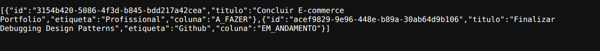
</p>

<p align="center">
  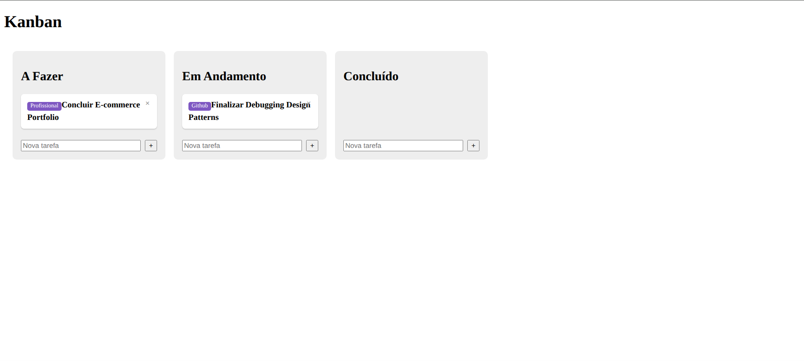
</p>

---

## Parte 11: CRUD Completo pela API

### Objetivo

Estender o backend com as operações de criação, movimentação e exclusão de cards, e conectar o frontend a elas, de modo que as três ações realizadas pela interface (já implementadas apenas em memória desde a Parte 7) passem a ser persistidas no backend.

### Implementação Realizada

- Adição de três novos endpoints ao `CardController`: `POST /cards` (criação), `PUT /cards/{id}/coluna` (movimentação entre colunas) e `DELETE /cards/{id}` (exclusão).
- Extensão de `KanbanService` com os métodos correspondentes: `criar`, `mover` e `excluir`.
- Criação do serviço `KanbanApiService`, no frontend, centralizando as quatro chamadas HTTP ao backend (`listar`, `criar`, `mover`, `excluir`).
- Alteração de `app.ts` para que `adicionar`, `remover` e `drop` passem a chamar `KanbanApiService`, em vez de manipular os arrays locais isoladamente.

### Código

`src/main/java/com/github/ahaerdy/backend/web/CardController.java`:

```java
package com.github.ahaerdy.backend.web;

import com.github.ahaerdy.backend.model.Card;
import com.github.ahaerdy.backend.service.KanbanService;
import org.springframework.web.bind.annotation.*;

import java.util.List;
import java.util.Map;

@RestController
@CrossOrigin(origins = "http://localhost:4200")
@RequestMapping("/cards")
public class CardController {

    private final KanbanService service;

    public CardController(KanbanService service) {
        this.service = service;
    }

    @GetMapping
    public List<Card> listar() {
        return service.listarTodos();
    }

    @PostMapping
    public Card criar(@RequestBody Card novo) {
        return service.criar(novo.getTitulo(), novo.getEtiqueta());
    }

    @PutMapping("/{id}/coluna")
    public void mover(@PathVariable String id, @RequestBody Map<String, String> body) {
        service.mover(id, body.get("coluna"));
    }

    @DeleteMapping("/{id}")
    public void excluir(@PathVariable String id) {
        service.excluir(id);
    }
}
```

`src/main/java/com/github/ahaerdy/backend/service/KanbanService.java`:

```java
package com.github.ahaerdy.backend.service;

import com.github.ahaerdy.backend.model.Card;
import org.springframework.stereotype.Service;

import java.util.List;
import java.util.UUID;
import java.util.concurrent.CopyOnWriteArrayList;

@Service
public class KanbanService {

    private final List<Card> cards = new CopyOnWriteArrayList<>(List.of(
        new Card(UUID.randomUUID().toString(), "Concluir E-commerce Portfolio", "Profissional", "A_FAZER"),
        new Card(UUID.randomUUID().toString(), "Finalizar Debugging Design Patterns", "Github", "EM_ANDAMENTO")
    ));

    public List<Card> listarTodos() {
        return cards;
    }

    public Card criar(String titulo, String etiqueta) {
        var novo = new Card(UUID.randomUUID().toString(), titulo, etiqueta, "A_FAZER");
        cards.add(novo);
        return novo;
    }

    public void mover(String id, String novaColuna) {
        cards.stream()
            .filter(c -> c.getId().equals(id))
            .findFirst()
            .ifPresent(c -> c.setColuna(novaColuna));
    }

    public void excluir(String id) {
        cards.removeIf(c -> c.getId().equals(id));
    }
}
```

`src/app/kanban-api.service.ts`:

```typescript
import { Injectable, inject } from '@angular/core';
import { HttpClient } from '@angular/common/http';
import { Card } from './models/card';

@Injectable({ providedIn: 'root' })
export class KanbanApiService {
  private http = inject(HttpClient);
  private baseUrl = 'http://localhost:8080/cards';

  listar() {
    return this.http.get<Card[]>(this.baseUrl);
  }

  criar(titulo: string, etiqueta: string) {
    return this.http.post<Card>(this.baseUrl, { titulo, etiqueta });
  }

  mover(id: string, coluna: string) {
    return this.http.put<void>(`${this.baseUrl}/${id}/coluna`, { coluna });
  }

  excluir(id: string) {
    return this.http.delete<void>(`${this.baseUrl}/${id}`);
  }
}
```

`src/app/app.ts`:

```typescript
import { Component, OnInit, inject, ChangeDetectorRef } from '@angular/core';
import { DragDropModule, CdkDragDrop, moveItemInArray, transferArrayItem } from '@angular/cdk/drag-drop';
import { Card } from './models/card';
import { CardItemComponent } from './card-item/card-item';
import { KanbanApiService } from './kanban-api.service';

interface CardApi extends Card {
  coluna: 'A_FAZER' | 'EM_ANDAMENTO' | 'CONCLUIDO';
}

const COLUNA_POR_ID: Record<string, 'A_FAZER' | 'EM_ANDAMENTO' | 'CONCLUIDO'> = {
  aFazer: 'A_FAZER',
  emAndamento: 'EM_ANDAMENTO',
  concluido: 'CONCLUIDO',
};

@Component({
  imports: [CardItemComponent, DragDropModule],
  selector: 'app-root',
  styleUrl: './app.scss',
  templateUrl: './app.html',
})
export class App implements OnInit {
  private api = inject(KanbanApiService);
  private cdr = inject(ChangeDetectorRef);

  aFazer: Card[] = [];
  emAndamento: Card[] = [];
  concluido: Card[] = [];

  ngOnInit() {
    this.api.listar().subscribe(cards => {
      const todas = cards as CardApi[];
      this.aFazer = todas.filter(c => c.coluna === 'A_FAZER');
      this.emAndamento = todas.filter(c => c.coluna === 'EM_ANDAMENTO');
      this.concluido = todas.filter(c => c.coluna === 'CONCLUIDO');
      this.cdr.markForCheck();
    });
  }

  drop(event: CdkDragDrop<Card[]>) {
    if (event.previousContainer === event.container) {
      moveItemInArray(event.container.data, event.previousIndex, event.currentIndex);
      return;
    }
    transferArrayItem(event.previousContainer.data, event.container.data, event.previousIndex, event.currentIndex);
    const card = event.container.data[event.currentIndex];
    const novaColuna = COLUNA_POR_ID[event.container.id];
    this.api.mover(card.id, novaColuna).subscribe();
  }

  adicionar(coluna: Card[], titulo: string) {
    if (!titulo.trim()) return;
    this.api.criar(titulo, 'Geral').subscribe(novo => {
      coluna.push(novo);
      this.cdr.markForCheck();
    });
  }

  remover(coluna: Card[], card: Card) {
    this.api.excluir(card.id).subscribe(() => {
      const index = coluna.indexOf(card);
      if (index >= 0) coluna.splice(index, 1);
      this.cdr.markForCheck();
    });
  }
}
```

### Descrição Técnica

- `COLUNA_POR_ID` é um objeto usado como tabela de tradução entre o `id` do elemento `cdkDropList` de destino (`'aFazer'`, atributo definido no template desde a Parte 6) e o valor de coluna esperado pela API (`'A_FAZER'`). `event.container.id`, fornecido pelo CDK ao evento de soltar, informa em qual `cdkDropList` o card foi solto.
- A persistência da movimentação (`api.mover`) ocorre apenas quando há transferência entre colunas; uma reordenação dentro da mesma coluna não altera o campo `coluna` do card, portanto não há necessidade de sincronização com o servidor nesse caso. A posição relativa dentro de uma mesma coluna não é persistida nesta etapa.
- A criação de um card espera a resposta do servidor (`subscribe(novo => ...)`) antes de exibi-lo na interface, garantindo que o identificador usado pelo rastreamento do bloco `@for` (`track c.id`) seja sempre o identificador real gerado pelo backend, e não um valor provisório gerado no navegador.
- A exclusão segue a mesma lógica: a remoção visual só ocorre após a confirmação do servidor.
- Já a movimentação por arrastar e soltar atualiza a interface de forma imediata, antes da confirmação do servidor, priorizando a fluidez da interação; uma falha na chamada ao backend, nesse caso específico, deixaria a interface temporariamente fora de sincronia com o banco, cenário não tratado nesta etapa.
- Em `ngOnInit`, `adicionar` e `remover`, a chamada a `this.cdr.markForCheck()` permanece necessária pelo mesmo motivo já registrado na Parte 9: essas atualizações de estado ocorrem dentro de um retorno assíncrono (`subscribe`), fora do alcance da notificação automática de mudanças desta versão zoneless do Angular. Já em `drop`, a mutação do array é síncrona, disparada diretamente por um evento de template, dispensando essa chamada.

### Glossário

| Termo | Significado |
|---|---|
| **`@RequestMapping`** | Anotação Spring que define um prefixo de rota, aplicável a nível de classe ou de método; as anotações de verbo (`@GetMapping`, `@PostMapping`, etc.) são atalhos que a combinam com um método HTTP fixo. |
| **Variável de caminho** (*path variable*) | Trecho de uma URL, delimitado por chaves na anotação de rota, tratado como parâmetro em vez de texto literal. |
| **`@RequestBody`** | Anotação Spring que desserializa o corpo de uma requisição HTTP em um objeto Java. |
| **`@PathVariable`** | Anotação Spring que extrai o valor de uma variável de caminho e o entrega como parâmetro do método. |
| **CRUD** | Sigla para *Create, Read, Update, Delete*: as quatro operações básicas sobre um dado persistido. |
| **`@Injectable({ providedIn: 'root' })`** | Registra um serviço Angular como singleton global, injetável em qualquer componente. |
| **Atualização otimista** | Padrão de interface em que a mudança é refletida na tela antes da confirmação do servidor, priorizando a responsividade da interação. |

### Resultado

Testes de criação de cards adicionais ("TESTE ....." e "Outro TESTE ...") confirmaram a persistência correta: a resposta de `GET /cards` passou a incluir os quatro cards, cada um com um identificador único gerado pelo backend (formato UUID), e com o campo `coluna` correspondente à posição em que cada card foi criado. A interface exibiu corretamente os quatro cards em suas respectivas colunas, com o botão de remoção funcional em cada um. Comportamento validado conforme esperado.

<p align="center">
  
</p>

<p align="center">
  
</p>

---

## Parte 12: Persistência em MySQL via Docker Compose

### Objetivo

Substituir a lista de cards mantida em memória por persistência real em um banco de dados MySQL, resolvendo a perda de dados observada a cada reinício do processo backend.

### Implementação Realizada

- Instalação do Docker e criação de um arquivo `docker-compose.yml`, na raiz do projeto backend, definindo um container MySQL 8.0 com volume nomeado para persistência dos dados em disco.
- Adição das dependências `spring-boot-starter-data-jpa` e `mysql-connector-j` ao `pom.xml`.
- Criação do arquivo `src/main/resources/application.properties`, com a URL de conexão JDBC e as credenciais do banco.
- Transformação da classe `Card` em uma entidade JPA, por meio das anotações `@Entity` e `@Id`.
- Criação da interface `CardRepository`, estendendo `JpaRepository`, substituindo a lista em memória de `KanbanService`.

### Código

`docker-compose.yml`:

```yaml
services:
  mysql:
    image: mysql:8.0
    container_name: kanban-mysql
    restart: unless-stopped
    environment:
      MYSQL_DATABASE: kanban
      MYSQL_USER: kanban
      MYSQL_PASSWORD: kanban
      MYSQL_ROOT_PASSWORD: kanban_root
    ports:
      - "3306:3306"
    volumes:
      - kanban_mysql_data:/var/lib/mysql

volumes:
  kanban_mysql_data:
```

`src/main/resources/application.properties`:

```properties
spring.datasource.url=jdbc:mysql://localhost:3306/kanban
spring.datasource.username=kanban
spring.datasource.password=kanban
spring.jpa.hibernate.ddl-auto=update
spring.jpa.properties.hibernate.dialect=org.hibernate.dialect.MySQLDialect
```

`src/main/java/com/github/ahaerdy/backend/model/Card.java`:

```java
package com.github.ahaerdy.backend.model;

import jakarta.persistence.Entity;
import jakarta.persistence.Id;

@Entity
public class Card {

    @Id
    private String id;
    private String titulo;
    private String etiqueta;
    private String coluna;

    public Card() {
    }

    public Card(String id, String titulo, String etiqueta, String coluna) {
        this.id = id;
        this.titulo = titulo;
        this.etiqueta = etiqueta;
        this.coluna = coluna;
    }

    public String getId() {
        return id;
    }

    public void setId(String id) {
        this.id = id;
    }

    public String getTitulo() {
        return titulo;
    }

    public void setTitulo(String titulo) {
        this.titulo = titulo;
    }

    public String getEtiqueta() {
        return etiqueta;
    }

    public void setEtiqueta(String etiqueta) {
        this.etiqueta = etiqueta;
    }

    public String getColuna() {
        return coluna;
    }

    public void setColuna(String coluna) {
        this.coluna = coluna;
    }
}
```

`src/main/java/com/github/ahaerdy/backend/repository/CardRepository.java`:

```java
package com.github.ahaerdy.backend.repository;

import com.github.ahaerdy.backend.model.Card;
import org.springframework.data.jpa.repository.JpaRepository;

public interface CardRepository extends JpaRepository<Card, String> {
}
```

`src/main/java/com/github/ahaerdy/backend/service/KanbanService.java`:

```java
package com.github.ahaerdy.backend.service;

import com.github.ahaerdy.backend.model.Card;
import com.github.ahaerdy.backend.repository.CardRepository;
import org.springframework.stereotype.Service;

import java.util.List;
import java.util.UUID;

@Service
public class KanbanService {

    private final CardRepository repository;

    public KanbanService(CardRepository repository) {
        this.repository = repository;
    }

    public List<Card> listarTodos() {
        return repository.findAll();
    }

    public Card criar(String titulo, String etiqueta) {
        var novo = new Card(UUID.randomUUID().toString(), titulo, etiqueta, "A_FAZER");
        return repository.save(novo);
    }

    public void mover(String id, String novaColuna) {
        repository.findById(id).ifPresent(c -> {
            c.setColuna(novaColuna);
            repository.save(c);
        });
    }

    public void excluir(String id) {
        repository.deleteById(id);
    }
}
```

`CardController.java` não foi alterado nesta etapa: sua interface pública permaneceu idêntica à da Parte 11, apenas a implementação de `KanbanService`, por trás dele, mudou de estratégia de armazenamento.

### Descrição Técnica

- O volume nomeado (`kanban_mysql_data`), declarado no `docker-compose.yml`, é o responsável pela persistência real dos dados: o container em si é descartável (pode ser removido e recriado), mas o volume, gerenciado separadamente pelo Docker, sobrevive a essa remoção.
- `@Entity` e `@Id`, no Hibernate (implementação de JPA usada por baixo do Spring Data), mapeiam cada instância de `Card` para uma linha de uma tabela chamada `card`, usando o campo `id` como chave primária.
- `JpaRepository<Card, String>`, ao ser estendido por `CardRepository`, fornece automaticamente os métodos `findAll`, `save`, `findById` e `deleteById`, sem exigir implementação manual.
- A assinatura pública de `KanbanService` (`listarTodos`, `criar`, `mover`, `excluir`) permaneceu idêntica à da Parte 11; apenas a fonte dos dados mudou de uma lista em memória para o banco de dados, por meio de `CardRepository`. Essa estabilidade de interface é o benefício concreto de ter isolado a lógica de negócio na camada de serviço desde a Parte 10.

### Glossário

| Termo | Significado |
|---|---|
| **Docker** | Plataforma para empacotar e rodar aplicações em containers isolados. |
| **Docker Compose** | Ferramenta que descreve, em um arquivo YAML, um ou mais containers relacionados e os inicia com um único comando. |
| **Volume (Docker)** | Área de armazenamento gerenciada pelo Docker que sobrevive à remoção do container. |
| **JPA** (*Jakarta Persistence API*) | Especificação Java para mapear objetos para tabelas de banco de dados relacional (ORM). |
| **Hibernate** | Implementação de JPA usada por baixo do Spring Data JPA. |
| **`JpaRepository<T, ID>`** | Interface do Spring Data que fornece operações CRUD prontas para uma entidade, sem exigir implementação manual. |
| **Driver JDBC** | Biblioteca que implementa a comunicação de rede específica de um banco de dados. |

### Resultado

A persistência foi validada por meio de uma sequência de testes: criação dos cards "Teste 01" (coluna Em Andamento) e "Teste 02" (coluna Concluído), seguida da movimentação de "Teste 02" para a coluna Em Andamento, confirmada tanto na resposta de `GET /cards` quanto na interface. Em seguida, o card "Teste 02" foi removido, e o backend foi reiniciado; após a reinicialização, a resposta de `GET /cards` continuou contendo exclusivamente o card "Teste 01", confirmando que os dados sobreviveram ao reinício do processo Java, resolvendo a limitação observada desde a Parte 8.

<p align="center">
  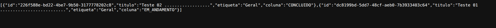
</p>

<p align="center">
  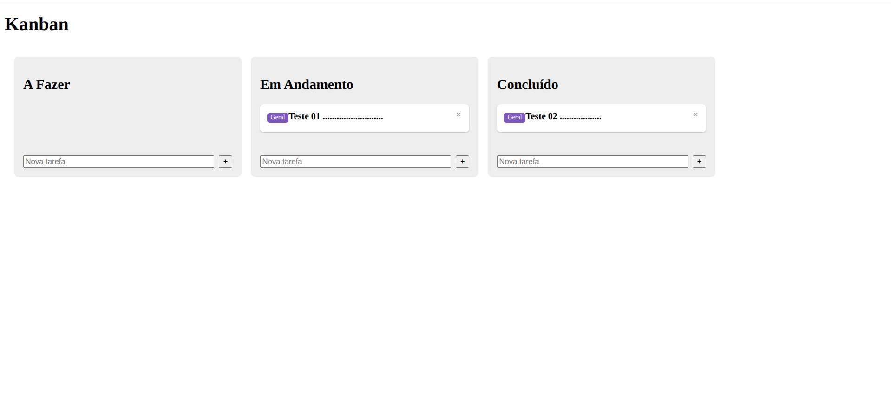
</p>

<p align="center">
  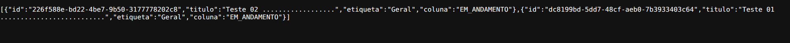
</p>

<p align="center">
  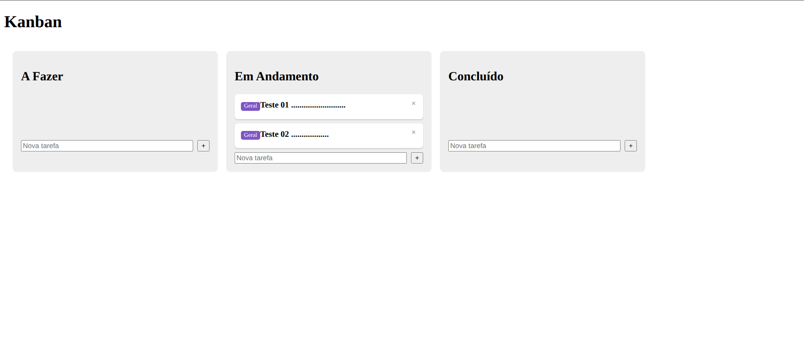
</p>

<p align="center">
  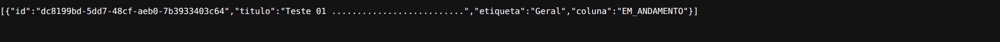
</p>

<p align="center">
  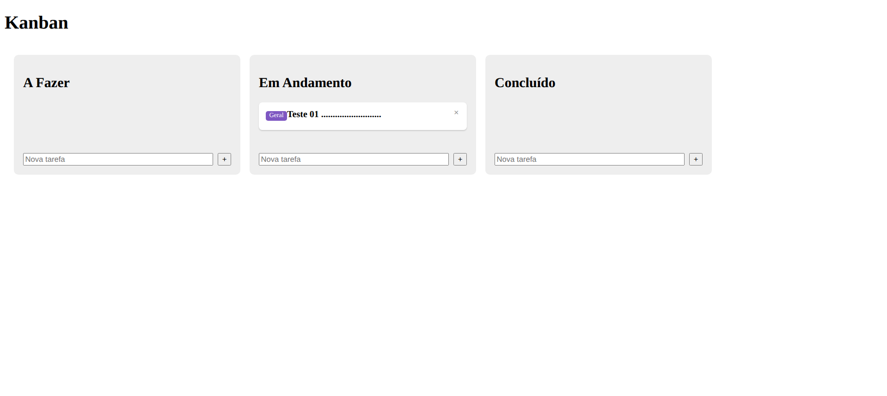
</p>

---

## Parte 13: Campo `coluna` como `enum` no Backend

### Objetivo

Restringir o campo `coluna` a um conjunto fechado de valores válidos também no backend, substituindo o tipo `String` por um `enum` Java, de modo que valores inexistentes passem a ser rejeitados na fronteira da API, em vez de aceitos e persistidos.

### Limitação Identificada

Desde a Parte 4, o frontend restringe o campo `coluna` a um tipo de união de literais de string (`'A_FAZER' | 'EM_ANDAMENTO' | 'CONCLUIDO'`), verificado pelo compilador TypeScript. No backend, porém, o campo sempre foi uma `String` livre, escrita como texto literal em vários pontos do código (por exemplo, `"A_FAZER"` em `KanbanService.criar`), e o corpo da requisição de movimentação era recebido como `Map<String, String>`, sem tipo nem verificação de conteúdo. Nada impedia o envio de um valor inexistente (por exemplo, `"A_FASER"`) para `PUT /cards/{id}/coluna`: o backend o aceitaria e o persistiria, produzindo um card "órfão", não exibido por nenhuma das três colunas do frontend. A proteção de tipos existia, portanto, em apenas um dos lados da comunicação, e não alcançava requisições originadas fora da interface (por exemplo, via `curl`).

### Implementação Realizada

- Criação do `enum` `ColunaEnum`, no pacote `model`, com as três constantes `A_FAZER`, `EM_ANDAMENTO` e `CONCLUIDO`.
- Criação do `record` `ColunaRequest`, no pacote `web`, em substituição a `Map<String, String>` como tipo do corpo da requisição de movimentação de card.
- Alteração da entidade `Card`: o campo `coluna` (e, consequentemente, o construtor, o getter e o setter correspondentes) passou de `String` para `ColunaEnum`, acompanhado da anotação `@Enumerated(EnumType.STRING)`.
- Alteração de `CardController`: o método `mover` passou a receber `ColunaRequest` em vez de `Map<String, String>`.
- Alteração de `KanbanService`: `criar` passou a atribuir `ColunaEnum.A_FAZER` ao novo card, e `mover` passou a receber um `ColunaEnum` em vez de `String`.
- Nenhuma alteração no frontend.

### Código

`src/main/java/com/github/ahaerdy/backend/model/ColunaEnum.java`:

```java
package com.github.ahaerdy.backend.model;

public enum ColunaEnum {
    A_FAZER, EM_ANDAMENTO, CONCLUIDO
}
```

`src/main/java/com/github/ahaerdy/backend/web/ColunaRequest.java`:

```java
package com.github.ahaerdy.backend.web;

import com.github.ahaerdy.backend.model.ColunaEnum;

public record ColunaRequest(ColunaEnum coluna) {
}
```

`src/main/java/com/github/ahaerdy/backend/model/Card.java`:

```java
package com.github.ahaerdy.backend.model;

import jakarta.persistence.Entity;
import jakarta.persistence.EnumType;
import jakarta.persistence.Enumerated;
import jakarta.persistence.Id;

@Entity
public class Card {

    @Id
    private String id;
    private String titulo;
    private String etiqueta;

    @Enumerated(EnumType.STRING)
    private ColunaEnum coluna;

    public Card() {
    }

    public Card(String id, String titulo, String etiqueta, ColunaEnum coluna) {
        this.id = id;
        this.titulo = titulo;
        this.etiqueta = etiqueta;
        this.coluna = coluna;
    }

    public String getId() {
        return id;
    }

    public void setId(String id) {
        this.id = id;
    }

    public String getTitulo() {
        return titulo;
    }

    public void setTitulo(String titulo) {
        this.titulo = titulo;
    }

    public String getEtiqueta() {
        return etiqueta;
    }

    public void setEtiqueta(String etiqueta) {
        this.etiqueta = etiqueta;
    }

    public ColunaEnum getColuna() {
        return coluna;
    }

    public void setColuna(ColunaEnum coluna) {
        this.coluna = coluna;
    }
}
```

`src/main/java/com/github/ahaerdy/backend/web/CardController.java`:

```java
package com.github.ahaerdy.backend.web;

import com.github.ahaerdy.backend.model.Card;
import com.github.ahaerdy.backend.service.KanbanService;
import org.springframework.web.bind.annotation.*;

import java.util.List;

@RestController
@CrossOrigin(origins = "http://localhost:4200")
@RequestMapping("/cards")
public class CardController {

    private final KanbanService service;

    public CardController(KanbanService service) {
        this.service = service;
    }

    @GetMapping
    public List<Card> listar() {
        return service.listarTodos();
    }

    @PostMapping
    public Card criar(@RequestBody Card novo) {
        return service.criar(novo.getTitulo(), novo.getEtiqueta());
    }

    @PutMapping("/{id}/coluna")
    public void mover(@PathVariable String id, @RequestBody ColunaRequest body) {
        service.mover(id, body.coluna());
    }

    @DeleteMapping("/{id}")
    public void excluir(@PathVariable String id) {
        service.excluir(id);
    }
}
```

`src/main/java/com/github/ahaerdy/backend/service/KanbanService.java`:

```java
package com.github.ahaerdy.backend.service;

import com.github.ahaerdy.backend.model.Card;
import com.github.ahaerdy.backend.model.ColunaEnum;
import com.github.ahaerdy.backend.repository.CardRepository;
import org.springframework.stereotype.Service;

import java.util.List;
import java.util.UUID;

@Service
public class KanbanService {

    private final CardRepository repository;

    public KanbanService(CardRepository repository) {
        this.repository = repository;
    }

    public List<Card> listarTodos() {
        return repository.findAll();
    }

    public Card criar(String titulo, String etiqueta) {
        var novo = new Card(UUID.randomUUID().toString(), titulo, etiqueta, ColunaEnum.A_FAZER);
        return repository.save(novo);
    }

    public void mover(String id, ColunaEnum novaColuna) {
        repository.findById(id).ifPresent(c -> {
            c.setColuna(novaColuna);
            repository.save(c);
        });
    }

    public void excluir(String id) {
        repository.deleteById(id);
    }
}
```

Nenhum arquivo do frontend foi alterado nesta etapa. `KanbanApiService.mover` já enviava `{ coluna }` com um valor de texto (por exemplo, `"EM_ANDAMENTO"`), formato que o backend passou a converter automaticamente para a constante correspondente de `ColunaEnum`.

### Descrição Técnica

- Um `enum` Java declara um conjunto fechado e nomeado de constantes; o compilador rejeita a atribuição de qualquer valor fora desse conjunto. `ColunaEnum` é, no backend, o equivalente do tipo de união de literais (`'A_FAZER' | 'EM_ANDAMENTO' | 'CONCLUIDO'`) que o frontend possui desde a Parte 4. A diferença relevante é o momento da verificação: no frontend, ela ocorre em tempo de compilação do TypeScript; no backend, além da compilação Java, ela também ocorre em tempo de execução, no momento em que o corpo JSON de uma requisição é convertido em objeto, ponto em que dados externos entram no sistema.
- `@Enumerated(EnumType.STRING)` instrui o JPA a persistir o `enum` pelo nome textual da constante (`"A_FAZER"`) na coluna do banco. Sem a anotação, o comportamento padrão seria `EnumType.ORDINAL`, que grava apenas a posição numérica da constante na declaração do `enum` (`0` para a primeira, `1` para a segunda, e assim por diante). O armazenamento ordinal é mais compacto, mas frágil: a inserção de uma nova constante no meio da declaração, ou a alteração da ordem das existentes, faria os números já gravados passarem a apontar para constantes diferentes das originais, corrompendo silenciosamente os dados antigos, sem nenhum erro visível. `EnumType.STRING` ocupa mais espaço no banco, mas é imune a esse problema.
- Como os nomes das constantes de `ColunaEnum` são idênticos aos valores textuais já gravados desde a Parte 12 (`A_FAZER`, `EM_ANDAMENTO`, `CONCLUIDO`), os registros já persistidos permanecem compatíveis com o novo tipo, sem necessidade de migração dos dados.
- `record ColunaRequest(ColunaEnum coluna)` é um *record* Java (recurso disponível desde o Java 16; o projeto utiliza Java 21), forma concisa de declarar uma classe imutável voltada a carregar dados, sem necessidade de escrever construtor, getters, `equals`, `hashCode` e `toString`. Seus métodos de acesso são gerados sem o prefixo `get`, motivo pelo qual o controlador usa `body.coluna()`. Em relação ao `Map<String, String>` anterior, o tipo explicita o campo esperado e o seu tipo, eliminando a chave textual `"coluna"` que era buscada com `body.get("coluna")`, sem verificação em tempo de compilação.
- A rejeição de valores inválidos ocorre antes da execução do método do controlador: o Jackson, biblioteca de serialização JSON utilizada pelo Spring, ao não conseguir converter o texto recebido em nenhuma constante de `ColunaEnum`, faz o Spring responder com `400 Bad Request`, sem que `KanbanService` chegue a ser invocado. O mesmo vale para `POST /cards`, cujo `@RequestBody Card` também passou a ter `coluna` tipada como `ColunaEnum`: um corpo com `coluna` inexistente é igualmente recusado. O frontend não é afetado, pois envia apenas `titulo` e `etiqueta` nessa chamada, e `KanbanService.criar` atribui sempre `A_FAZER` ao novo card.
- O contrato JSON entre frontend e backend permaneceu idêntico ao da Parte 12: o Jackson serializa um `enum` pelo nome da constante, de modo que a resposta de `GET /cards` continua contendo `"coluna": "A_FAZER"`, e o valor enviado por `KanbanApiService.mover` continua sendo um texto. É por essa razão que nenhuma linha do frontend precisou ser alterada. Assim como na Parte 12, a mudança ficou confinada ao interior do backend, sem propagação para os consumidores da API.
- Uma limitação remanescente: o conjunto de valores válidos de `coluna` passou a ser declarado em dois lugares independentes, o `enum` `ColunaEnum` no backend e o tipo de união de literais (juntamente com `COLUNA_POR_ID` em `app.ts`) no frontend. Não existe mecanismo automático de sincronização entre eles; a adição de uma quarta coluna exigiria alterar ambos manualmente.

### Glossário

| Termo | Significado |
|---|---|
| **`enum`** (Java) | Tipo que representa um conjunto fixo e nomeado de constantes; aqui, os três estados possíveis de uma coluna. |
| **`@Enumerated`** | Anotação JPA que define a estratégia de persistência de um campo do tipo `enum`. |
| **`EnumType.STRING`** | Estratégia que persiste o `enum` pelo nome textual da constante; imune a mudanças na ordem de declaração. |
| **`EnumType.ORDINAL`** | Estratégia padrão do JPA, que persiste apenas a posição numérica da constante; sujeita a corrupção silenciosa de dados se a ordem de declaração mudar. |
| **`record`** (Java) | Tipo de classe concisa, introduzido no Java 16, voltada para carregar dados imutáveis, com construtor e métodos de acesso gerados automaticamente. |
| **Jackson** | Biblioteca de serialização e desserialização JSON utilizada pelo Spring para converter o corpo das requisições em objetos Java e vice-versa. |
| **`400 Bad Request`** | Código de status HTTP que indica que a requisição enviada pelo cliente é malformada ou inválida. |

### Resultado

A implementação foi concluída sem erros de compilação, e o comportamento foi validado conforme esperado. O fluxo normal do frontend (listagem, criação, movimentação entre as três colunas e exclusão de cards) permaneceu idêntico ao da Parte 12, sem qualquer alteração no código Angular. Uma requisição manual `PUT /cards/{id}/coluna` com corpo contendo um valor inexistente (`{"coluna": "NAO_EXISTE"}`) passou a ser recusada com `400 Bad Request`, em vez de aceita silenciosamente, fechando a lacuna descrita na limitação identificada no início desta entrada.

<!-- Inserir aqui as capturas de tela desta etapa, no mesmo formato das entradas anteriores:
<p align="center">
  
</p>
-->

---

## Parte 14: Etiquetas como Coleção de `Enum` com Cor

### Objetivo

Substituir o campo `etiqueta` (singular, `String` livre desde a Parte 7) por uma coleção `etiquetas`, permitindo mais de uma etiqueta por card e eliminando a necessidade de uma classe CSS escrita à mão para cada etiqueta nova, ao associar uma cor fixa a cada valor possível diretamente no backend.

### Implementação Realizada

- Criação do `enum` `EtiquetaEnum`, no pacote `model`, com cinco constantes (`PROFISSIONAL`, `ESTUDOS`, `GITHUB`, `PRIORIDADE_ALTA`, `GEMINI`), cada uma associada a uma cor fixa (`corHex`) por meio de um construtor e um campo próprios do `enum`.
- Anotação de `EtiquetaEnum` com `@JsonFormat(shape = JsonFormat.Shape.OBJECT)`, para que cada constante seja serializada como um objeto JSON, e não apenas como o nome da constante.
- Alteração da entidade `Card`: o campo `etiqueta` foi removido e substituído por `etiquetas`, uma `List<EtiquetaEnum>` anotada com `@ElementCollection`, persistida em uma tabela auxiliar própria (sem entidade dedicada).
- Alteração de `KanbanService.criar` e de `CardController.criar`, que deixaram de receber e repassar uma etiqueta: um card novo nasce com a coleção `etiquetas` vazia.
- Alteração do modelo `Card` do frontend (`models/card.ts`): substituição do campo `etiqueta: string` por `etiquetas: Etiqueta[]`, com a nova interface `Etiqueta` (`name` e `corHex`).
- Alteração de `card-item.html` e `card-item.ts`: o template passou a percorrer `card.etiquetas` com `@for`, renderizando uma `<span class="tag">` por etiqueta, com a cor vinda de `[style.background]="e.corHex"`; foi adicionado o método `formatarNome`, que converte o nome bruto da constante (por exemplo, `PRIORIDADE_ALTA`) para uma forma de leitura mais natural (`Prioridade Alta`).
- Alteração de `card-item.scss`: remoção da cor fixa da classe `.tag` (agora definida por card, via `[style.background]`) e adição de espaçamento para o caso de mais de uma etiqueta no mesmo card.
- Alteração de `KanbanApiService.criar` e de `app.ts`, que deixaram de enviar e de atribuir a etiqueta `"Geral"` na criação de um card.
- Não foi construída, nesta etapa, nenhuma interface para atribuição de etiquetas a um card; a única forma de associá-las, por ora, é uma alteração direta na tabela correspondente do banco.

### Dificuldades Identificadas Durante a Implementação

A implementação inicial seguiu à risca o conteúdo do tutorial e não apresentou erro de compilação em nenhum dos dois projetos. A movimentação de cards entre colunas continuou funcionando normalmente, inclusive com persistência correta no MySQL. O problema surgiu ao testar a funcionalidade desta etapa: uma etiqueta associada manualmente a um card, por meio de `UPDATE card SET etiqueta = 'GITHUB' WHERE id = ...`, não aparecia no frontend, apesar de o valor estar corretamente gravado no banco.

A investigação revelou três causas distintas, as duas últimas não descritas no tutorial original:

1. **Coluna errada.** O comando `UPDATE` alterava a coluna `etiqueta` (singular), remanescente da Parte 7. Como a entidade `Card` desta parte não possui mais esse campo, e `spring.jpa.hibernate.ddl-auto=update` (configurado na Parte 12) apenas acrescenta estrutura ao banco, sem nunca remover uma coluna sem correspondência na entidade, essa coluna passou a ser ignorada por completo pelo backend, permanecendo na tabela como um resquício órfão. A coleção `etiquetas` (plural), introduzida por `@ElementCollection`, reside em uma tabela própria e distinta (`card_etiquetas`), até então vazia.
2. **Ausência do campo `name` no JSON.** Reproduzida isoladamente com a biblioteca Jackson: `@JsonFormat(shape = JsonFormat.Shape.OBJECT)`, sozinha, faz o Jackson serializar cada constante de `EtiquetaEnum` incluindo um par chave-valor para cada método de acesso (`get*`) nela declarado — o que, com apenas `getCorHex()` declarado, produzia unicamente `{"corHex":"#29b6f6"}`, sem o campo `name` do qual o frontend depende (`card.etiquetas`, em `card-item.html`, e o parâmetro de `formatarNome`, em `card-item.ts`). Sem esse campo, `formatarNome(undefined)` lançaria um `TypeError` assim que um card com ao menos uma etiqueta fosse renderizado. A correção consistiu na adição de um método `getName()` a `EtiquetaEnum`, retornando `name()` (método presente em todo `enum` Java, com o nome da constante).
3. **Risco de persistência ordinal.** O campo `etiquetas`, tal como apresentado inicialmente no tutorial, não trazia a anotação `@Enumerated(EnumType.STRING)`, com o mesmo risco já identificado na Parte 13 para o campo `coluna`: sem ela, o JPA persistiria, para cada etiqueta, apenas a posição numérica da constante em `EtiquetaEnum`, e não o seu nome. A correção consistiu na adição dessa anotação ao campo `etiquetas`.

Como a tabela `card_etiquetas` já havia sido criada pelo Hibernate no formato incorreto (numérico) antes da correção do item 3, e `ddl-auto=update` também não altera o tipo de uma coluna já existente, foi necessário interromper o backend e excluir manualmente essa tabela (`DROP TABLE card_etiquetas;`) para que fosse recriada, já no formato textual, na inicialização seguinte. Após as três correções, uma nova associação de etiqueta, feita diretamente na tabela `card_etiquetas` (`INSERT INTO card_etiquetas (card_id, etiquetas) VALUES (...)`), passou a ser exibida corretamente no frontend, com a cor e o texto formatado esperados.

### Código

`src/main/java/com/github/ahaerdy/backend/model/EtiquetaEnum.java`:

```java
package com.github.ahaerdy.backend.model;

import com.fasterxml.jackson.annotation.JsonFormat;

@JsonFormat(shape = JsonFormat.Shape.OBJECT)
public enum EtiquetaEnum {
    PROFISSIONAL("#7e57c2"),
    ESTUDOS("#43a047"),
    GITHUB("#29b6f6"),
    PRIORIDADE_ALTA("#e53935"),
    GEMINI("#fb8c00");

    private final String corHex;

    EtiquetaEnum(String corHex) {
        this.corHex = corHex;
    }

    public String getName() {
        return name();
    }

    public String getCorHex() {
        return corHex;
    }
}
```

`src/main/java/com/github/ahaerdy/backend/model/Card.java`:

```java
package com.github.ahaerdy.backend.model;

import jakarta.persistence.ElementCollection;
import jakarta.persistence.Entity;
import jakarta.persistence.EnumType;
import jakarta.persistence.Enumerated;
import jakarta.persistence.FetchType;
import jakarta.persistence.Id;

import java.util.ArrayList;
import java.util.List;

@Entity
public class Card {

    @Id
    private String id;
    private String titulo;

    @Enumerated(EnumType.STRING)
    private ColunaEnum coluna;

    @Enumerated(EnumType.STRING)
    @ElementCollection(fetch = FetchType.EAGER)
    private List<EtiquetaEnum> etiquetas = new ArrayList<>();

    public Card() {
    }

    public Card(String id, String titulo, ColunaEnum coluna) {
        this.id = id;
        this.titulo = titulo;
        this.coluna = coluna;
    }

    public String getId() {
        return id;
    }

    public void setId(String id) {
        this.id = id;
    }

    public String getTitulo() {
        return titulo;
    }

    public void setTitulo(String titulo) {
        this.titulo = titulo;
    }

    public ColunaEnum getColuna() {
        return coluna;
    }

    public void setColuna(ColunaEnum coluna) {
        this.coluna = coluna;
    }

    public List<EtiquetaEnum> getEtiquetas() {
        return etiquetas;
    }

    public void setEtiquetas(List<EtiquetaEnum> etiquetas) {
        this.etiquetas = etiquetas;
    }
}
```

`src/main/java/com/github/ahaerdy/backend/service/KanbanService.java`:

```java
package com.github.ahaerdy.backend.service;

import com.github.ahaerdy.backend.model.Card;
import com.github.ahaerdy.backend.model.ColunaEnum;
import com.github.ahaerdy.backend.repository.CardRepository;
import org.springframework.stereotype.Service;

import java.util.List;
import java.util.UUID;

@Service
public class KanbanService {

    private final CardRepository repository;

    public KanbanService(CardRepository repository) {
        this.repository = repository;
    }

    public List<Card> listarTodos() {
        return repository.findAll();
    }

    public Card criar(String titulo) {
        var novo = new Card(UUID.randomUUID().toString(), titulo, ColunaEnum.A_FAZER);
        return repository.save(novo);
    }

    public void mover(String id, ColunaEnum novaColuna) {
        repository.findById(id).ifPresent(c -> {
            c.setColuna(novaColuna);
            repository.save(c);
        });
    }

    public void excluir(String id) {
        repository.deleteById(id);
    }
}
```

`src/main/java/com/github/ahaerdy/backend/web/CardController.java`:

```java
package com.github.ahaerdy.backend.web;

import com.github.ahaerdy.backend.model.Card;
import com.github.ahaerdy.backend.service.KanbanService;
import org.springframework.web.bind.annotation.*;

import java.util.List;

@RestController
@CrossOrigin(origins = "http://localhost:4200")
@RequestMapping("/cards")
public class CardController {

    private final KanbanService service;

    public CardController(KanbanService service) {
        this.service = service;
    }

    @GetMapping
    public List<Card> listar() {
        return service.listarTodos();
    }

    @PostMapping
    public Card criar(@RequestBody Card novo) {
        return service.criar(novo.getTitulo());
    }

    @PutMapping("/{id}/coluna")
    public void mover(@PathVariable String id, @RequestBody ColunaRequest body) {
        service.mover(id, body.coluna());
    }

    @DeleteMapping("/{id}")
    public void excluir(@PathVariable String id) {
        service.excluir(id);
    }
}
```

`src/app/models/card.ts`:

```typescript
export interface Etiqueta {
  name: string;
  corHex: string;
}

export interface Card {
  id: string;
  titulo: string;
  etiquetas: Etiqueta[];
}
```

`src/app/card-item/card-item.ts`:

```typescript
import { Component, EventEmitter, Input, Output } from '@angular/core';
import { Card } from '../models/card';

@Component({
  imports: [],
  selector: 'app-card-item',
  styleUrl: './card-item.scss',
  templateUrl: './card-item.html',
})
export class CardItemComponent {
  @Input({ required: true }) card!: Card;
  @Output() remover = new EventEmitter<Card>();

  formatarNome(nome: string): string {
    return nome
      .toLowerCase()
      .replace(/_/g, ' ')
      .replace(/\b\w/g, letra => letra.toUpperCase());
  }
}
```

`src/app/card-item/card-item.html`:

```html
<div class="card">
  @for (e of card.etiquetas; track e.name) {
    <span class="tag" [style.background]="e.corHex">{{ formatarNome(e.name) }}</span>
  }
  <strong>{{ card.titulo }}</strong>
  <button class="remover" (click)="remover.emit(card)">×</button>
</div>
```

`src/app/card-item/card-item.scss`:

```scss
.card { background: white; border-radius: 6px; padding: 0.75rem; margin-bottom: 0.5rem; box-shadow: 0 1px 2px rgba(0,0,0,.15); position: relative; }
.tag { display: inline-block; font-size: 0.7rem; color: white; border-radius: 4px; padding: 2px 6px; margin-bottom: 4px; margin-right: 4px; }
.remover { position: absolute; top: 0.5rem; right: 0.5rem; border: none; background: transparent; cursor: pointer; font-size: 0.9rem; color: #999; }
```

`src/app/kanban-api.service.ts`:

```typescript
import { Injectable, inject } from '@angular/core';
import { HttpClient } from '@angular/common/http';
import { Card } from './models/card';

@Injectable({ providedIn: 'root' })
export class KanbanApiService {
  private http = inject(HttpClient);
  private baseUrl = 'http://localhost:8080/cards';

  listar() {
    return this.http.get<Card[]>(this.baseUrl);
  }

  criar(titulo: string) {
    return this.http.post<Card>(this.baseUrl, { titulo });
  }

  mover(id: string, coluna: string) {
    return this.http.put<void>(`${this.baseUrl}/${id}/coluna`, { coluna });
  }

  excluir(id: string) {
    return this.http.delete<void>(`${this.baseUrl}/${id}`);
  }
}
```

`src/app/app.ts` (única alteração em relação à Parte 11: `adicionar` deixa de passar `'Geral'` a `api.criar`):

```typescript
import { Component, OnInit, inject, ChangeDetectorRef } from '@angular/core';
import { DragDropModule, CdkDragDrop, moveItemInArray, transferArrayItem } from '@angular/cdk/drag-drop';
import { Card } from './models/card';
import { CardItemComponent } from './card-item/card-item';
import { KanbanApiService } from './kanban-api.service';

interface CardApi extends Card {
  coluna: 'A_FAZER' | 'EM_ANDAMENTO' | 'CONCLUIDO';
}

const COLUNA_POR_ID: Record<string, 'A_FAZER' | 'EM_ANDAMENTO' | 'CONCLUIDO'> = {
  aFazer: 'A_FAZER',
  emAndamento: 'EM_ANDAMENTO',
  concluido: 'CONCLUIDO',
};

@Component({
  imports: [CardItemComponent, DragDropModule],
  selector: 'app-root',
  styleUrl: './app.scss',
  templateUrl: './app.html',
})
export class App implements OnInit {
  private api = inject(KanbanApiService);
  private cdr = inject(ChangeDetectorRef);

  aFazer: Card[] = [];
  emAndamento: Card[] = [];
  concluido: Card[] = [];

  ngOnInit() {
    this.api.listar().subscribe(cards => {
      const todas = cards as CardApi[];
      this.aFazer = todas.filter(c => c.coluna === 'A_FAZER');
      this.emAndamento = todas.filter(c => c.coluna === 'EM_ANDAMENTO');
      this.concluido = todas.filter(c => c.coluna === 'CONCLUIDO');
      this.cdr.markForCheck();
    });
  }

  drop(event: CdkDragDrop<Card[]>) {
    if (event.previousContainer === event.container) {
      moveItemInArray(event.container.data, event.previousIndex, event.currentIndex);
      return;
    }
    transferArrayItem(event.previousContainer.data, event.container.data, event.previousIndex, event.currentIndex);
    const card = event.container.data[event.currentIndex];
    const novaColuna = COLUNA_POR_ID[event.container.id];
    this.api.mover(card.id, novaColuna).subscribe();
  }

  adicionar(coluna: Card[], titulo: string) {
    if (!titulo.trim()) return;
    this.api.criar(titulo).subscribe(novo => {
      coluna.push(novo);
      this.cdr.markForCheck();
    });
  }

  remover(coluna: Card[], card: Card) {
    this.api.excluir(card.id).subscribe(() => {
      const index = coluna.indexOf(card);
      if (index >= 0) coluna.splice(index, 1);
      this.cdr.markForCheck();
    });
  }
}
```

### Descrição Técnica

- `@ElementCollection` mapeia uma coleção de valores simples (aqui, `enum`s) associada a uma entidade, persistindo-a em uma tabela auxiliar própria, sem exigir a criação de uma entidade `Etiqueta` completa, com `id` e tabela dedicados. Essa entidade separada só se justificaria se etiquetas precisassem ser criadas ou editadas dinamicamente pelo usuário, o que não é um requisito deste projeto por ora.
- `@Enumerated(EnumType.STRING)`, aplicada ao campo `etiquetas`, tem o mesmo papel já discutido na Parte 13 para o campo `coluna`: sem ela, o JPA persistiria, para cada elemento da coleção, apenas a posição numérica da constante correspondente em `EtiquetaEnum`, sujeita a corrupção silenciosa caso a ordem de declaração das constantes viesse a mudar.
- `@JsonFormat(shape = JsonFormat.Shape.OBJECT)` instrui o Jackson a serializar cada constante de `EtiquetaEnum` como um objeto JSON, com um par chave-valor para cada um dos seus métodos de acesso (`get*`), em vez de apenas o nome da constante como uma string simples. O conjunto de campos presentes no objeto resultante depende exclusivamente dos métodos `get*` declarados no `enum`: com apenas `getCorHex()`, o objeto conteria somente `corHex`. A adição de `getName()`, retornando `name()` (método presente em todo `enum` Java, com o nome da constante conforme declarado no código), foi o que passou a incluir o campo `name` no JSON, do qual o template do card e o método `formatarNome` dependem.
- `formatarNome(nome: string)`, no frontend, converte o nome bruto da constante (por exemplo, `PRIORIDADE_ALTA`) para uma forma de leitura mais natural (`Prioridade Alta`), sem exigir nenhuma tradução mantida manualmente no backend. Por depender do argumento `nome` já ser uma `string`, essa função presume que o campo `name` está presente no objeto recebido; a ausência desse campo faz `nome.toLowerCase()` lançar `TypeError: Cannot read properties of undefined`.
- `spring.jpa.hibernate.ddl-auto=update` (Parte 12) aplica ao esquema do banco apenas alterações aditivas: cria tabelas e colunas ausentes, mas nunca remove uma coluna ou tabela que deixou de ter correspondência na entidade, nem altera o tipo de uma coluna já existente. Por essa razão, a remoção do campo `etiqueta` (singular) desta entidade não removeu a coluna correspondente, já criada em uma parte anterior, e a correção da anotação `@Enumerated` sobre `etiquetas`, após a tabela `card_etiquetas` já existir no formato numérico, exigiu a exclusão manual dessa tabela para que fosse recriada no formato correto.
- O contrato de criação de card (`POST /cards`) permanece aceitando um `Card` completo no corpo da requisição, mas `KanbanService.criar` passou a ignorar qualquer coleção de etiquetas eventualmente enviada, atribuindo sempre uma lista vazia ao novo card; a atribuição automática da etiqueta `"Geral"`, existente desde a Parte 7, foi removida.

### Glossário

| Termo | Significado |
|---|---|
| **`@ElementCollection`** | Anotação JPA para mapear uma coleção de valores simples (não entidades completas) associada a uma entidade dona, persistida em uma tabela auxiliar. |
| **`@Enumerated(EnumType.STRING)`** | Anotação JPA que faz a persistência de um `enum` (ou de uma coleção de `enum`s) gravar o nome textual da constante, em vez da sua posição numérica. |
| **`@JsonFormat(shape = JsonFormat.Shape.OBJECT)`** | Anotação do Jackson que serializa um `enum` como um objeto JSON, com um campo para cada método de acesso (`get*`) nele declarado. |
| **`name()`** (Java) | Método presente em todo `enum` Java, que devolve o nome da constante tal como declarado no código-fonte. |
| **`TypeError`** (JavaScript/TypeScript) | Exceção lançada ao tentar executar uma operação sobre um valor de tipo incompatível, como chamar um método de `string` sobre `undefined`. |
| **`[style.background]`** | Vínculo de propriedade do Angular que define diretamente uma propriedade CSS a partir de uma expressão. |
| **Enum com atributo** (Java) | Um `enum` pode ter campos e construtor próprios, permitindo associar dados fixos (aqui, uma cor) a cada constante. |

### Resultado

Após a correção das três causas identificadas — remoção da coluna obsoleta como origem do dado a ser buscado, adição de `getName()` a `EtiquetaEnum` e de `@Enumerated(EnumType.STRING)` ao campo `etiquetas`, com a consequente recriação da tabela `card_etiquetas` —, uma etiqueta inserida manualmente na tabela correta passou a ser exibida no frontend com a cor e o texto formatado esperados, conforme validado por meio de captura de tela. O fluxo normal do frontend (listagem, criação, movimentação entre colunas e exclusão de cards) permaneceu funcional durante todo o processo, inclusive antes da correção, confirmando que o problema estava isolado à exibição de etiquetas.

<!-- Inserir aqui as capturas de tela desta etapa, no mesmo formato das entradas anteriores:
<p align="center">
  
</p>
-->

---

## Parte 15: `KanbanStateService` e um Segundo Consumidor do Estado

### Objetivo

Introduzir um serviço central (`KanbanStateService`) que mantém o estado dos cards e notifica automaticamente qualquer consumidor interessado, resolvendo o cenário em que um segundo componente (por exemplo, um contador) precisa saber quando `App` move, cria ou exclui um card, sem comunicação direta entre os dois. Validar esse mecanismo com um componente ilustrativo, `CardCountComponent`, que exibe o total de cards.

### Implementação Realizada

- Criação de `KanbanStateService`, no diretório `src/app`, encapsulando `KanbanApiService` por trás de um `BehaviorSubject<Card[]>` exposto como `cards$`, com os métodos `carregar`, `mover`, `criar` e `excluir`.
- Criação de `CardCountComponent`, em `src/app/card-count`, inscrito diretamente em `KanbanStateService.cards$` e exibindo o total de cards via `AsyncPipe`.
- Adição da tag `<app-card-count />` a `app.html`, logo abaixo de `<h1>Kanban</h1>`.
- Adição de `CardCountComponent` ao array `imports` do `@Component` de `App`, em `app.ts` — única alteração nesse arquivo nesta etapa. `App` continuou consumindo `KanbanApiService` diretamente, como manteve desde a Parte 11; a migração de `App` para `KanbanStateService` foi identificada como possível, mas deliberadamente não realizada nesta parte.

### Código

`src/app/kanban-state.service.ts`:

```typescript
import { Injectable, inject } from '@angular/core';
import { BehaviorSubject } from 'rxjs';
import { KanbanApiService } from './kanban-api.service';
import { Card } from './models/card';

@Injectable({ providedIn: 'root' })
export class KanbanStateService {
  private api = inject(KanbanApiService);
  private cardsSubject = new BehaviorSubject<Card[]>([]);
  readonly cards$ = this.cardsSubject.asObservable();

  carregar() {
    this.api.listar().subscribe(cards => this.cardsSubject.next(cards));
  }

  mover(id: string, coluna: string) {
    this.api.mover(id, coluna).subscribe(() => this.carregar());
  }

  criar(titulo: string) {
    this.api.criar(titulo).subscribe(() => this.carregar());
  }

  excluir(id: string) {
    this.api.excluir(id).subscribe(() => this.carregar());
  }
}
```

`src/app/card-count/card-count.ts`:

```typescript
import { Component, inject } from '@angular/core';
import { AsyncPipe } from '@angular/common';
import { KanbanStateService } from '../kanban-state.service';

@Component({
  imports: [AsyncPipe],
  selector: 'app-card-count',
  templateUrl: './card-count.html',
})
export class CardCountComponent {
  private state = inject(KanbanStateService);
  cards$ = this.state.cards$;
}
```

`src/app/card-count/card-count.html`:

```html
<p>{{ (cards$ | async)?.length ?? 0 }} cards no total</p>
```

`src/app/app.ts` — único trecho alterado em relação à Parte 14, no array `imports` do `@Component`:

```typescript
import { CardCountComponent } from './card-count/card-count';
// ...
@Component({
  imports: [CardItemComponent, DragDropModule, CardCountComponent],
  // ...
})
```

### Descrição Técnica

- `BehaviorSubject<Card[]>` é um `Observable` do RxJS que guarda o valor mais recente e o entrega imediatamente a qualquer novo inscrito, além de notificar todos os inscritos existentes a cada `.next(...)`. É o mesmo papel de um ponto central de notificação, agora resolvido por uma biblioteca em vez de uma implementação manual do padrão Observer.
- `.asObservable()` expõe `cards$` como somente leitura para quem consome o serviço; apenas o próprio `KanbanStateService` pode chamar `.next(...)`, por meio dos métodos `carregar`, `mover`, `criar` e `excluir`.
- `AsyncPipe` (`| async`), usado no template de `CardCountComponent`, inscreve-se automaticamente em um `Observable` e libera a inscrição quando o componente é destruído, chamando `markForCheck()` internamente a cada emissão — por isso `CardCountComponent` não precisa de nenhuma injeção manual de `ChangeDetectorRef`.
- `CardCountComponent` não depende de `App` para saber quantos cards existem: ele injeta `KanbanStateService` diretamente. Isso, porém, também significa que ele só é notificado de mudanças que passem pelo próprio `KanbanStateService` — uma distinção que se mostrou relevante no teste desta parte.
- Como `App` continuou chamando `KanbanApiService` diretamente nesta etapa, nenhuma ação realizada pela interface (criar, mover ou excluir um card) passa por `KanbanStateService`. O `BehaviorSubject` desse serviço, portanto, nunca recebe um `.next(...)` a partir das ações do usuário.

### Resultado

`CardCountComponent` foi adicionado e exibido corretamente na interface, sem erro de compilação. Ao testar, porém, o contador permaneceu fixo em `0 cards no total`, mesmo com cards visíveis nas três colunas. A investigação (registrada com mais detalhe na Parte 16, a seguir) confirmou que esse comportamento era esperado, e não uma falha de implementação: nada, em nenhum ponto do código desta etapa, chama `KanbanStateService.carregar()`, `mover()`, `criar()` ou `excluir()` — `App` seguia gerenciando seus três arrays por conta própria, via `KanbanApiService`, exatamente a fronteira que esta parte documentava como deliberadamente não cruzada. A resolução desse sintoma é o objeto da Parte 16.

<p align="center">
  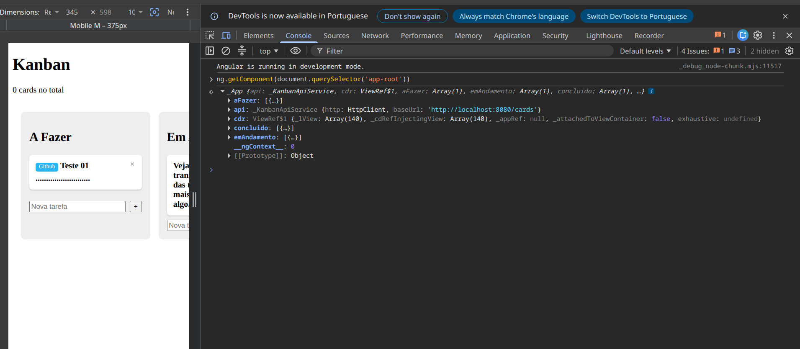
</p>

---

## Parte 16: Migração de `App` para o `KanbanStateService`

### Objetivo

Eliminar a causa do contador de cards permanecer em `0`, identificada ao final da Parte 15, migrando `App` para consumir `KanbanStateService` no lugar de `KanbanApiService` diretamente — a fronteira que aquela parte havia deixado, por decisão consciente, do outro lado.

### Limitação Identificada

Com `CardCountComponent` já exibido na interface (Parte 15), o valor mostrado permanecia `0 cards no total` mesmo após a criação de cards pela interface. A inspeção do componente `App` pelo console do navegador (`ng.getComponent(document.querySelector('app-root'))`) confirmou o diagnóstico: o objeto retornado trazia `aFazer`, `emAndamento` e `concluido` já povoados (refletindo os cards existentes), mas nenhuma referência a `KanbanStateService` — apenas a `_KanbanApiService`, injetada desde a Parte 9. Como `KanbanStateService.cards$` é um `BehaviorSubject` que só emite um novo valor quando algum dos seus próprios métodos (`carregar`, `mover`, `criar`, `excluir`) é chamado, e nada em `App` chamava qualquer um deles, o `Observable` permanecia parado no valor inicial (`[]`) para sempre — daí o `0` exibido por `CardCountComponent`, mesmo com cards reais existindo nos arrays internos de `App`.

### Implementação Realizada

- Substituição, em `App`, de `inject(KanbanApiService)` por `inject(KanbanStateService)`.
- Alteração de `ngOnInit`: a assinatura, antes feita em `this.api.listar()`, passou a ser feita em `this.state.cards$`, mantendo a mesma lógica de distribuir a lista recebida nos três arrays (`aFazer`, `emAndamento`, `concluido`) exigidos pelo `cdkDropListData` do Angular CDK. Uma chamada a `this.state.carregar()` foi adicionada logo em seguida, para disparar a primeira emissão do `BehaviorSubject`.
- Alteração de `drop`, `adicionar` e `remover`: as chamadas a `KanbanApiService.mover`, `.criar` e `.excluir` foram substituídas pelos métodos equivalentes de `KanbanStateService`. Como esses métodos já chamam `carregar()` internamente ao final (Parte 15), a atualização otimista manual dos arrays, existente desde a Parte 11 (`coluna.push(novo)` em `adicionar`; `coluna.splice(...)` em `remover`), foi removida: a lista atualizada chega pela própria assinatura em `cards$`.
- Nenhuma alteração em `app.html`, `card-count.ts`, `card-count.html` ou `kanban-state.service.ts`.

### Código

`src/app/app.ts`:

```typescript
import { Component, OnInit, inject, ChangeDetectorRef } from '@angular/core';
import { DragDropModule, CdkDragDrop, moveItemInArray, transferArrayItem } from '@angular/cdk/drag-drop';
import { Card } from './models/card';
import { CardItemComponent } from './card-item/card-item';
import { CardCountComponent } from './card-count/card-count';
import { KanbanStateService } from './kanban-state.service';

interface CardApi extends Card {
  coluna: 'A_FAZER' | 'EM_ANDAMENTO' | 'CONCLUIDO';
}

const COLUNA_POR_ID: Record<string, 'A_FAZER' | 'EM_ANDAMENTO' | 'CONCLUIDO'> = {
  aFazer: 'A_FAZER',
  emAndamento: 'EM_ANDAMENTO',
  concluido: 'CONCLUIDO',
};

@Component({
  imports: [CardItemComponent, DragDropModule, CardCountComponent],
  selector: 'app-root',
  styleUrl: './app.scss',
  templateUrl: './app.html',
})
export class App implements OnInit {
  private state = inject(KanbanStateService);
  private cdr = inject(ChangeDetectorRef);

  aFazer: Card[] = [];
  emAndamento: Card[] = [];
  concluido: Card[] = [];

  ngOnInit() {
    this.state.cards$.subscribe(cards => {
      const todas = cards as CardApi[];
      this.aFazer = todas.filter(c => c.coluna === 'A_FAZER');
      this.emAndamento = todas.filter(c => c.coluna === 'EM_ANDAMENTO');
      this.concluido = todas.filter(c => c.coluna === 'CONCLUIDO');
      this.cdr.markForCheck();
    });
    this.state.carregar();
  }

  drop(event: CdkDragDrop<Card[]>) {
    if (event.previousContainer === event.container) {
      moveItemInArray(event.container.data, event.previousIndex, event.currentIndex);
      return;
    }
    transferArrayItem(event.previousContainer.data, event.container.data, event.previousIndex, event.currentIndex);
    const card = event.container.data[event.currentIndex];
    const novaColuna = COLUNA_POR_ID[event.container.id];
    this.state.mover(card.id, novaColuna);
  }

  adicionar(coluna: Card[], titulo: string) {
    if (!titulo.trim()) return;
    this.state.criar(titulo);
  }

  remover(coluna: Card[], card: Card) {
    this.state.excluir(card.id);
  }
}
```

### Descrição Técnica

- A troca central é `inject(KanbanApiService)` por `inject(KanbanStateService)`: `App` deixa de ser um consumidor direto da API HTTP e passa a ser só mais um consumidor do estado compartilhado, no mesmo nível que `CardCountComponent`, e não mais uma fonte paralela de verdade sobre os cards.
- A chamada a `this.state.carregar()`, em `ngOnInit`, é o que efetivamente popula `cards$`: como o `BehaviorSubject` nasce com `[]`, alguém precisa chamar `carregar()` ao menos uma vez para que a lista real chegue a qualquer inscrito. Antes desta parte, esse "alguém" não existia; agora é o próprio `App`, na sua inicialização.
- A remoção da atualização otimista manual (`coluna.push(novo)`, `coluna.splice(...)`) não é uma perda de funcionalidade: como `KanbanStateService.criar`/`mover`/`excluir` já chamam `carregar()` internamente, a nova lista completa chega de qualquer forma pela assinatura em `cards$`, tornando redundante qualquer atualização manual dos mesmos arrays.
- Um efeito colateral observável, embora imperceptível em `localhost`: mover um card entre colunas passou a depender da resposta da chamada ao backend para a interface se atualizar (antes, a interface mudava imediatamente e a chamada à API ocorria à parte). A reordenação de cards dentro da mesma coluna, que nunca gerou chamada à API desde a Parte 11, continua imediata, pois `moveItemInArray` é aplicado diretamente sobre o array antes de qualquer envolvimento do serviço.
- `CardCountComponent` não precisou de nenhuma alteração: ele sempre dependeu apenas de `cards$`. A diferença introduzida por esta parte é que agora existe, de fato, alguém alimentando esse `Observable` com dados reais.

### Glossário

| Termo | Significado |
|---|---|
| **`ng.getComponent(elemento)`** | Utilitário exposto pelo Angular em modo de desenvolvimento (via DevTools do navegador) que retorna a instância do componente associada a um elemento do DOM, útil para inspecionar seu estado interno em tempo de execução. |
| **Fonte única de verdade** (*single source of truth*) | Princípio de design segundo o qual um dado deve ter exatamente um ponto de origem autoritativo; múltiplas cópias sincronizadas manualmente (como `App` e `KanbanStateService` mantendo estado em paralelo) tendem a divergir. |

### Resultado

Após a migração, o frontend foi recarregado e o contador passou a exibir o total correto de cards já na carga inicial da página, sem qualquer comando manual no console. A criação de um novo card ("Teste 02") elevou o contador de `3` para `4`, conforme confirmado por captura de tela, validando que `CardCountComponent` responde corretamente a uma ação disparada por `App`, através do canal comum (`KanbanStateService.cards$`). O fluxo de arrastar-e-soltar entre colunas e a exclusão de cards permaneceram funcionais, sem regressão observada.

<p align="center">
  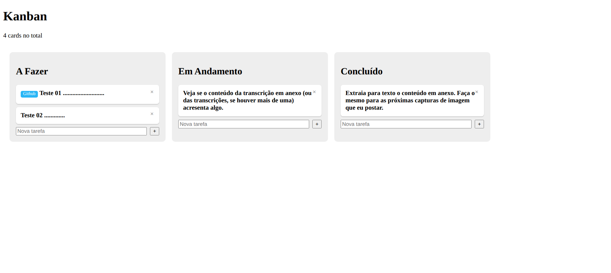
</p>

---

